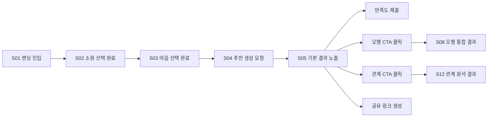

# 01. PRD — 원석 큐레이터 (Gemstone Curator)

- 문서 버전: 0.1.0
- 최종 수정일: 2026-09-11 (Asia/Seoul)
- 상태: Draft

## Executive Summary

원석 큐레이터는 사용자가 지금 바라는 변화와 마음 상태를 짧은 선택형 흐름으로 입력하면, 결정론적 규칙 엔진이 대표 원석 1개를 선정하고 AI가 위로·행동 제안 카피를 생성해주는 모바일 우선 자기성찰 서비스다. Phase 1은 비회원도 첫 추천을 받을 수 있는 MVP, Phase 2는 오행 분석과 계정/보관함, Phase 3는 관계 원석 궁합을 다룬다. 전체 개요는 [00-project-overview.md](00-project-overview.md)를 참조한다.

## 사용자 문제

- 지금 내 마음이 무엇을 원하는지 스스로 언어화하기 어렵다.
- 기존 사주·타로형 서비스는 생년월일시, 회원가입 등 초기 진입장벽이 높다.
- 짧고 감성적인 위로와 실행 가능한 작은 행동을 원하지만, 대부분의 서비스는 결과가 길고 추상적이다.
- 결과를 SNS·메신저에 공유하고 싶지만 개인정보 노출을 걱정한다.

## Persona

### Primary Persona

- **이름(예시)**: 20대 후반 직장인
- **연령**: 20~39세
- **행동**: 모바일 중심, 짧은 감성 콘텐츠 소비, 원석/오행/운세 콘텐츠에 관심
- **목표**: 지금 마음을 정리하고 상징적인 원석 하나로 작은 위안을 얻는다
- **좌절 요인**: 긴 입력 절차, 강제 회원가입, 불명확한 근거의 추천

### Secondary Persona

- **이름(예시)**: 관계에 관심이 많은 사용자
- **행동**: 기본 추천을 경험한 뒤 상대방과의 관계 궁합 기능까지 탐색
- **목표**: 특정 관계(연인, 가족, 친구)에서 자신과 상대, 관계 자체를 상징하는 원석을 알고 싶어함
- **좌절 요인**: 상대방의 민감정보를 강제로 요구하는 서비스에 대한 거부감

## Jobs to be Done

1. 지금 내가 바라는 변화를 몇 번의 선택만으로 정리하고 싶다.
2. 근거 있어 보이는 상징적 결과(원석)를 빠르게 받고 싶다.
3. 결과를 보고 짧게 위로받고, 오늘 실천할 수 있는 작은 행동 하나를 얻고 싶다.
4. (선택) 내 오행을 알아보고 더 깊은 추천을 받고 싶다.
5. (선택) 특정 관계에서 나와 상대, 관계 자체를 상징하는 원석을 알고 싶다.
6. 결과를 잃지 않게 저장하거나, 개인정보 없이 지인과 공유하고 싶다.

## 사용자 스토리

- 비회원으로서, 나는 회원가입 없이 소원과 마음을 선택해 원석 추천을 받고 싶다.
- 사용자로서, 나는 추천받은 원석이 왜 나에게 맞는지 근거를 짧게 이해하고 싶다.
- 사용자로서, 나는 위로 문장과 함께 오늘 바로 할 수 있는 작은 행동을 안내받고 싶다.
- 사용자로서, 나는 AI 응답이 실패해도 결과 화면이 끊기지 않고 완성되길 원한다.
- 사용자로서, 나는 원한다면 생년월일시를 추가로 입력해 오행 기반 심화 추천을 받고 싶다.
- 사용자로서, 나는 생년월일시를 원하지 않으면 입력하지 않고도 서비스를 계속 쓸 수 있어야 한다.
- 사용자로서, 나는 특정 관계의 목표를 선택해 나·상대·관계를 상징하는 원석을 알고 싶다.
- 사용자로서, 나는 결과를 민감정보 없이 카드 형태로 공유하고 싶다.
- 회원으로서, 나는 과거 추천 결과를 보관함에서 다시 볼 수 있어야 한다.
- 사용자로서, 나는 언제든 내가 제공한 개인정보 동의를 철회하고 데이터를 삭제 요청할 수 있어야 한다.
- 사용자로서, 위기 상황을 암시하는 표현을 입력했을 때 서비스가 안전 안내를 제공하길 원한다.

## 기능 요구사항 (Functional Requirements)

요구사항 ID 형식은 `FR-BASIC-###`(Phase 1), `FR-FIVE-###`(Phase 2 오행), `FR-REL-###`(Phase 3 관계)를 사용한다. 화면 ID는 [04-screen-specifications.md](04-screen-specifications.md)의 S01~S14, API 경로는 [07-api-specification.md](07-api-specification.md), 테스트 ID는 [10-testing-and-acceptance.md](10-testing-and-acceptance.md#traceability-matrix)를 따른다.

### Phase 1 — 기본 추천

| ID | 설명 | 우선순위 | Phase | 관련 화면 | 관련 API | 관련 테스트 |
|---|---|---|---|---|---|---|
| FR-BASIC-001 | 모바일 우선 랜딩 페이지에서 서비스 가치와 시작 CTA를 제공한다 | P0 | 1 | S01 | - | E2E-01 |
| FR-BASIC-002 | 사용자는 소원 태그를 최대 2개(주 소원 1개 필수, 보조 소원 1개 선택) 선택할 수 있다 | P0 | 1 | S02 | `GET /catalog/wishes`, `POST /recommendations/basic` | E2E-01 |
| FR-BASIC-003 | 사용자는 현재 마음과 가까운 문장(감정 태그) 1개를 선택한다 | P0 | 1 | S03 | `GET /catalog/wishes`, `POST /recommendations/basic` | E2E-01 |
| FR-BASIC-004 | 사용자는 선택적으로 최대 300자 자유 입력을 추가할 수 있으며, 원문은 저장·로깅되지 않는다 | P0 | 1 | S03 | `POST /recommendations/basic` | E2E-07 |
| FR-BASIC-005 | 규칙 기반 엔진이 입력 신호를 바탕으로 대표 원석 1개를 결정론적으로 산출한다 | P0 | 1 | S04, S05 | `POST /recommendations/basic` | ENGINE-01~05 |
| FR-BASIC-006 | 결과 화면은 AI가 생성한 추천 이유(rationale)를 표시한다 | P0 | 1 | S05 | `POST /recommendations/basic`, `GET /recommendations/{id}` | E2E-01 |
| FR-BASIC-007 | 결과 화면은 AI가 생성한 마음 요약(heartSummary)을 표시한다 | P0 | 1 | S05 | 동일 | E2E-01 |
| FR-BASIC-008 | 결과 화면은 위로 문장(comfortLines) 2~3개를 표시한다 | P0 | 1 | S05 | 동일 | E2E-01 |
| FR-BASIC-009 | 결과 화면은 5분 이내 실행 가능한 작은 행동(microAction) 1개를 표시한다 | P0 | 1 | S05 | 동일 | E2E-01 |
| FR-BASIC-010 | LLM 생성이 실패하거나 스키마 검증에 실패하면 검수된 fallback 문장으로 결과 화면을 완성한다 | P0 | 1 | S05 | `POST /recommendations/basic` | E2E-03 |
| FR-BASIC-011 | 사용자는 결과에 대해 1~5점 만족도를 남길 수 있다 | P1 | 1 | S05 | `POST /recommendations/{id}/feedback` | E2E-01 |
| FR-BASIC-012 | 결과 화면은 오행 분석 및 관계 기능에 대한 관심도 CTA를 노출한다 | P1 | 1 | S05 | - | E2E-01 |
| FR-BASIC-013 | 사용자는 회원가입 없이 비회원 세션으로 전체 기본 흐름을 완료할 수 있다 | P0 | 1 | S01~S05 | `POST /sessions` | E2E-01 |
| FR-BASIC-014 | 서비스는 개인정보가 포함되지 않는 분석 이벤트만 수집한다 | P0 | 1 | 전체 | 전체 | E2E-07 |
| FR-BASIC-015 | 서비스는 위기 표현 및 과도한 개인정보 입력을 감지해 안전 안내로 라우팅한다 | P0 | 1 | S03, S05 | `POST /recommendations/basic` | E2E-04 |
| FR-BASIC-016 | 결과 화면은 추천 원석을 검수된 사전 생성 실버 펜던트 목걸이 이미지로 표시하고, 생성 이미지 및 비판매 상품 안내와 이미지 실패 fallback을 제공한다 | P1 | 1 | S05 | `POST /recommendations/basic`, `GET /recommendations/{id}` | ASSET-01, E2E-01 |

### Phase 2 — 오행 분석

| ID | 설명 | 우선순위 | Phase | 관련 화면 | 관련 API | 관련 테스트 |
|---|---|---|---|---|---|---|
| FR-FIVE-001 | 사용자는 오행 분석 안내를 읽고 명시적으로 동의해야 다음 단계로 진행할 수 있다 | P0 | 2 | S06 | `POST /recommendations/{id}/five-elements` | E2E-05 |
| FR-FIVE-002 | 사용자는 양력/음력 구분과 생년월일시를 입력할 수 있다 | P0 | 2 | S07 | 동일 | E2E-05 |
| FR-FIVE-003 | 사용자는 출생시간을 모른다고 표시할 수 있으며, 이 경우 시주를 제외한 분석을 제공한다 | P0 | 2 | S07 | 동일 | E2E-05 |
| FR-FIVE-004 | 오행 분석 결과를 반영한 통합 원석 추천을 제공한다 | P0 | 2 | S08 | 동일 | E2E-05 |
| FR-FIVE-005 | ~~사용자는 계정을 생성하고 로그인할 수 있다~~ — 사용자가 명시적으로 "로그인 없이 사용" 방향을 선택해 **구현하지 않기로 확정**했다(docs/13 참조). 계정 없이도 서비스 전체를 이용할 수 있다는 원칙을 그대로 유지한다. | 취소 | 2 | - | - | - |
| FR-FIVE-006 | 사용자는 (로그인 없이) 같은 브라우저에서 과거 추천 결과를 보관함에서 조회할 수 있다 | P1 | 2 | S14 | `GET /recommendations`(세션 범위, 로그인 불필요) | E2E-library |
| FR-FIVE-007 | 사용자는 결과를 민감정보가 제거된 공유 카드로 생성하고, 링크는 만료된다 | P0 | 2 | S13 | `POST /recommendations/{id}/share-links`, `GET /shares/{token}`, `DELETE /share-links/{token}` | E2E-07 |
| FR-FIVE-008 | 사용자는 개인정보 동의를 조회·철회하고 데이터 삭제를 요청할 수 있다 | P0 | 2 | S14 | `DELETE /me/data` | E2E-08 |

### Phase 3 — 관계 원석

| ID | 설명 | 우선순위 | Phase | 관련 화면 | 관련 API | 관련 테스트 |
|---|---|---|---|---|---|---|
| FR-REL-001 | 사용자는 관계 유형과 관계 목표를 선택할 수 있다 | P0 | 3 | S09, S11 | `POST /recommendations/{id}/relationship` | E2E-06 |
| FR-REL-002 | 사용자는 상대방 별명과 나·상대방의 생년월일시를 모두 입력한다(오행 분석을 이미 마쳤다면 나의 생년월일시는 재사용) — 우리의 원석이 두 사람의 사주를 실제로 결합하려면 상대방 출생정보를 선택 사항으로 둘 수 없다는 판단에 따라 필수로 변경했다(docs/13 참조) | P0 | 3 | S10 | 동일 | E2E-06 |
| FR-REL-003 | 서비스는 나의 원석, 상대의 원석, 우리의 원석을 산출한다(우리의 원석은 나와 상대방의 오행 친화도를 함께 반영) | P0 | 3 | S12 | 동일 | E2E-06 |
| FR-REL-004 | 결과 화면은 관계 대화 질문과 작은 행동을 제공한다 | P1 | 3 | S12 | 동일 | E2E-06 |
| ~~FR-REL-005~~ | ~~사용자는 상대방을 초대할 수 있는 링크를 생성할 수 있다~~ — FR-REL-002가 상대방 생년월일시를 필수로 요구하게 되면서 "나중에 상대방이 채워 넣는" 초대 흐름이 도달 불가능해져 **제거하기로 확정**했다(docs/13 참조) | 취소 | 3 | - | - | - |
| ~~FR-REL-006~~ | ~~상대방이 초대에 응하면 양방향 관계 결과를 제공한다~~ — FR-REL-005와 함께 **제거**(docs/13 참조) | 취소 | 3 | - | - | - |

Phase 3 후반 확장 후보(원석 선물/커머스 연동, AI 수호 캐릭터 생성)는 본 PRD의 요구사항 ID로 확정하지 않으며 [13-decisions-and-open-questions.md](13-decisions-and-open-questions.md)의 미해결 질문으로 관리한다.

## 비기능 요구사항 (Non-Functional Requirements)

| ID | 설명 | 우선순위 | Phase | 관련 테스트 |
|---|---|---|---|---|
| NFR-SEC-001 | 모든 클라이언트-서버 통신은 TLS로 암호화한다 | P0 | 1 | SEC-01 |
| NFR-SEC-002 | 생년월일시, 자유 입력, 상대방 별명 등 민감 필드는 application-level envelope encryption으로 저장하며 평문 로깅을 금지한다 | P0 | 2 | SEC-02 |
| NFR-SEC-003 | 공유 토큰과 세션 토큰은 해시로만 저장하고, 원문은 발급 시점에만 1회 반환한다 | P0 | 1 | SEC-03 |
| NFR-SEC-004 | 공개 API(추천 생성, 공유 조회)에는 rate limiting을 적용한다 | P0 | 1 | SEC-04 |
| NFR-PERF-001 | 기본 추천 API(`POST /recommendations/basic`)는 P95 응답시간 목표를 가진다 (`추가 검증 필요`: 목표값은 LLM 지연 실측 후 확정) | P1 | 1 | PERF-01 |
| NFR-PERF-002 | 랜딩~기본 결과까지 모바일 Core Web Vitals(LCP, INP, CLS) 기준을 만족한다 (`추가 검증 필요`: 구체 수치는 실측 인프라 확정 후 결정) | P1 | 1 | PERF-02 |
| NFR-PERF-003 | 규칙 기반 추천 엔진의 순수 연산 시간은 100ms 미만을 목표로 한다 | P1 | 1 | ENGINE-06 |
| NFR-A11Y-001 | 모든 신규 화면은 WCAG 2.2 AA를 준수한다 | P0 | 1 | A11Y-01 |
| NFR-A11Y-002 | 핵심 흐름(S01~S05)은 키보드만으로 완료할 수 있다 | P0 | 1 | E2E-02 |
| NFR-A11Y-003 | 모든 모션·전환 효과는 `prefers-reduced-motion` 설정을 존중한다 | P1 | 1 | A11Y-02 |

## Phase별 범위

### Phase 1 범위

FR-BASIC-001~016, NFR-SEC-001/003/004, NFR-PERF-001~003, NFR-A11Y-001~003. 화면 S01~S05.

### Phase 2 범위

FR-FIVE-001~008, NFR-SEC-002. 화면 S06~S08, S13~S14.

### Phase 3 범위

FR-REL-001~006. 화면 S09~S12.

## 성공 지표

- 랜딩→기본 결과(S01→S05) 완료율 (`추가 검증 필요`: 목표 수치는 베타 데이터 확보 후 설정)
- 결과 만족도(1~5점) 평균 및 분포
- 오행 분석 진입 CTA 클릭률 → 동의 전환율
- 관계 기능 진입 CTA 클릭률 → 관계 결과 완료율
- 공유 카드 생성률, 공유 링크 조회수
- Fallback 문장 노출 비율 (낮을수록 LLM 파이프라인 건전성이 높음을 의미)
- 위기 표현 감지 트리거율 및 안전 안내 노출 후 이탈률

## 이벤트 퍼널

분석 이벤트 상세 목록과 개인정보 미포함 원칙은 [12-privacy-security-compliance.md](12-privacy-security-compliance.md#분석-이벤트-allowlist)를 참조한다.

## 위험과 완화책

| 위험 | 영향 | 완화책 |
|---|---|---|
| LLM 응답 지연·실패로 결과 화면이 끊김 | 이탈, 신뢰도 하락 | 검수된 fallback 문장 상시 대기, timeout/retry 정책 ([09-ai-prompts-and-safety.md](09-ai-prompts-and-safety.md#timeout-및-retry)) |
| 사용자가 위기 표현을 입력 | 사용자 안전, 법적 위험 | 안전 분류 프롬프트 + 규칙 기반 키워드 감지 이중 안전망 ([09-ai-prompts-and-safety.md](09-ai-prompts-and-safety.md#안전-분류-프롬프트)) |
| 생년월일시 등 민감정보 유출 | 개인정보 침해, 신뢰도 하락 | envelope encryption, 공유/분석 payload에서 제외 ([12-privacy-security-compliance.md](12-privacy-security-compliance.md)) |
| 추천 가중치가 실제 만족도와 괴리 | 제품 품질 저하 | 오프라인 평가 데이터셋과 실험 계획으로 반복 튜닝 ([08-recommendation-engine.md](08-recommendation-engine.md#추천-가중치-실험-계획)) |
| 관계 기능에서 상대방 동의 없는 정보 처리 | 제3자 개인정보 이슈 | 상대방 정보는 선택 입력, 별명 우선, 공유 payload에서 제거 ([12-privacy-security-compliance.md](12-privacy-security-compliance.md#상대방-정보-처리-정책)) |

## Definition of Done

각 요구사항은 다음을 모두 만족해야 완료로 간주한다.

1. 관련 화면이 [04-screen-specifications.md](04-screen-specifications.md)의 수용 기준을 충족한다.
2. 관련 API가 [07-api-specification.md](07-api-specification.md)의 요청/응답 스펙과 오류 처리 기준을 충족한다.
3. 관련 테스트가 [10-testing-and-acceptance.md](10-testing-and-acceptance.md)에 정의된 대로 작성되고 통과한다.
4. NFR-SEC, NFR-A11Y 관련 요구사항은 각각 보안·접근성 체크리스트를 통과한다.
5. 개인정보가 포함되는 기능은 [12-privacy-security-compliance.md](12-privacy-security-compliance.md) 체크리스트를 통과한다.

## Assumptions

- 성공 지표의 목표 수치는 베타 운영 데이터가 없어 구체값을 제시하지 않고 `추가 검증 필요`로 표시했다.
- FR-FIVE-006(보관함)은 계정이 아닌 브라우저 로컬 저장소(`localStorage`) 기반 세션으로 구현되므로, 기기를 바꾸거나 브라우저 데이터를 지우면 보관함 내용도 사라진다. 이는 "계정 없이 사용 가능"이라는 제품 원칙을 지키기 위한 의도적 트레이드오프다.

## 추가 검증 필요

- NFR-PERF-001/002의 구체적 수치 목표
- 성공 지표별 목표값(베타 데이터 확보 후 설정)
