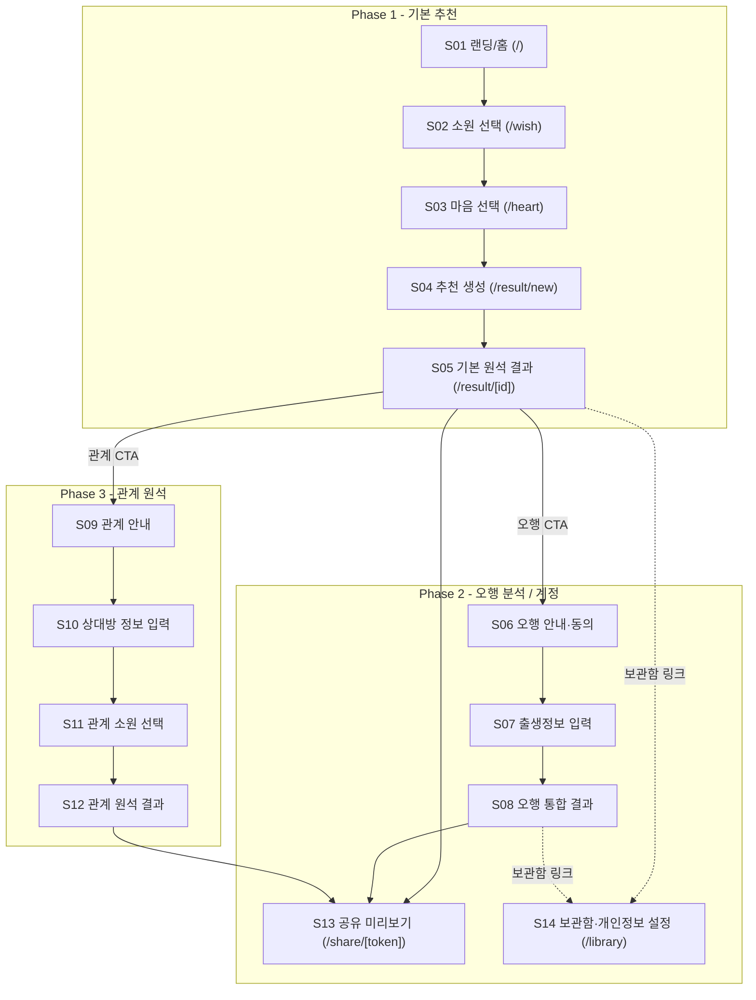

# 02. 정보 구조 — 원석 큐레이터

- 문서 버전: 0.1.0
- 최종 수정일: 2026-09-11 (Asia/Seoul)
- 상태: Draft

요구사항 근거는 [01-prd.md](01-prd.md), 화면별 상세는 [04-screen-specifications.md](04-screen-specifications.md)를 참조한다.

## 전체 사이트맵

## 모바일 내비게이션

- **1단계(핵심 흐름)**: S01 → S02 → S03 → S04 → S05는 선형 진행이며 하단 고정 Primary CTA로 다음 단계 이동. 상단 좌측 Back 아이콘으로 이전 단계 복귀.
- **2단계(확장 흐름)**: S05 결과 화면 하단에 오행/관계 CTA 카드를 배치. 진입 시 별도 스택(S06~S08, S09~S12)으로 진행하며 상단 Back으로 S05 복귀.
- **전역 내비게이션**: 계정 기능을 만들지 않기로 확정했으므로(`docs/13` 참조) 보관함(S14, `/library`)은 로그인 여부와 무관하게 랜딩 푸터와 결과 화면에서 링크로 노출한다. 다만 같은 브라우저(로컬 저장소)에 한정된 보관함이라는 점을 화면 문구로 안내한다.
- **하단 탭바는 사용하지 않는다.** 선형 완료형 흐름 특성상 탭 기반 내비게이션보다 단계형 진행이 사용자 목표에 부합한다(`추가 검증 필요`: 사용성 테스트로 확인).

## URL 구조

| 화면 ID | 경로 | 설명 |
|---|---|---|
| S01 | `/` | 랜딩 |
| S02 | `/wish` | 소원 선택 |
| S03 | `/heart` | 마음 선택 + 자유 입력 |
| S04 | `/result/new` | 추천 생성 로딩(클라이언트에서 API 호출 후 `/result/[recommendationId]`로 치환) |
| S05 | `/result/[recommendationId]` | 기본 원석 결과 |
| S06 | `/result/[recommendationId]/five-elements/intro` | 오행 안내·동의 |
| S07 | `/result/[recommendationId]/five-elements/birth-info` | 출생정보 입력 |
| S08 | `/result/[recommendationId]/five-elements` | 오행 통합 결과 |
| S09 | `/result/[recommendationId]/relationship/intro` | 관계 원석 안내 |
| S10 | `/result/[recommendationId]/relationship/partner-info` | 상대방 정보 입력 |
| S11 | `/result/[recommendationId]/relationship/wish` | 관계 소원 선택 |
| S12 | `/result/[recommendationId]/relationship` | 관계 원석 결과 |
| S13 | `/share/[token]` | 공유 미리보기 (공개) |
| S14 | `/library` | 보관함 및 개인정보 설정 — **실제 구현은 계정 없이 비회원 세션(로컬 저장소) 기준으로 동작**(원안은 "회원 전용"이었으나 `docs/13` 결정으로 변경) |
| (실제 구현 추가) | `/privacy` | "내 데이터 삭제" 확인 화면. S14의 "개인정보 설정" 탭에서 링크로 연결되며 `DELETE /sessions/current`를 호출한다([07-api-specification.md](07-api-specification.md#delete-sessionscurrent) 참조). |

`recommendationId`는 `Recommendation.id` (UUID), `token`은 `ShareLink` 공개 토큰(원문은 발급 시 1회만 노출, 서버는 해시만 저장 — [06-database-schema.md](06-database-schema.md#sharelink) 참조)이다.

## 접근 권한

| 화면 | 공개(비로그인, 세션 없음) | 비회원 세션 | 회원 |
|---|---|---|---|
| S01 | 접근 가능 | 접근 가능 | 접근 가능 |
| S02~S05 | 진입 시 `POST /sessions`로 세션 자동 발급 | 접근 가능 | 접근 가능 |
| S06~S08 | 세션 발급 후 접근 가능 | 접근 가능 (FR-FIVE-001 동의 필요) | 접근 가능 |
| S09~S12 | 세션 발급 후 접근 가능 | 접근 가능 | 접근 가능 |
| S13 | 접근 가능 (토큰 소유만으로 조회) | 접근 가능 | 접근 가능 |
| S14 | 세션 발급 후 접근 가능 (현재 세션 범위의 결과만) | 접근 가능 (현재 세션 범위의 결과만) | 접근 가능 |

오행·관계 기능은 비회원 세션으로도 이용 가능하다(회원가입 강제 금지 원칙, [00-project-overview.md](00-project-overview.md) 제품 구조 원칙). **계정 기능은 만들지 않기로 확정**했으므로(`docs/13` 참조) 결과 보관도 계정이 아닌 브라우저 로컬 저장소 기반 세션(`localStorage`, 서버 만료 30일)으로 동작하며, S05/S08에서 보관함(S14) 링크로 안내한다.

## 각 페이지의 역할

| 화면 | 역할 |
|---|---|
| S01 | 가치 제안 전달, 첫 진입 CTA |
| S02 | 소원 신호 수집(엔진 입력) |
| S03 | 감정 신호 및 선택적 자유 입력 수집(엔진/LLM 입력) |
| S04 | 규칙 엔진 실행 + LLM 카피 생성 대기 상태 표시 |
| S05 | 기본 추천 결과 소비 지점, 확장 기능 진입점 |
| S06 | 오행 분석 목적·데이터 사용 고지, 동의 획득 |
| S07 | 민감정보(생년월일시) 입력, 검증 |
| S08 | 오행 통합 결과 소비 |
| S09 | 관계 기능 가치 제안 |
| S10 | 상대방 정보(별명 필수, 출생정보 선택) 입력 |
| S11 | 관계 목표 신호 수집 |
| S12 | 관계 원석 결과 소비, 초대 링크 생성 |
| S13 | 제3자에게 노출되는 개인정보 없는 공유 카드 |
| S14 | 보관함 조회, 동의 관리, 데이터 삭제 |

## 뒤로가기·중단·재진입 정책

- **선형 흐름(S02~S04)**: 브라우저 뒤로가기는 이전 단계로 이동하며 이미 선택한 값은 유지한다(세션 스토리지 기반, `추가 검증 필요`: 클라이언트 상태 저장소 구현 방식).
- **중단 후 재진입**: `WishSession`은 비회원 세션에 연결되어 미완료 상태로 남으며, 완료되지 않은 세션은 결과를 생성하지 않는다. 사용자가 S01로 재진입하면 처음부터 다시 시작한다(중간 저장 재개는 Phase 1 범위 밖).
- **S04 로딩 중 이탈**: 사용자가 이탈해도 서버 측 추천 생성은 완료되며, 이후 `GET /recommendations/{id}`로 재조회 가능한 링크를 제공하지 않는다(Phase 1은 URL 공유 전 완료 대기가 기본; 딥링크 정책은 아래 참조).
- **S06~S08, S09~S12 확장 흐름 중단**: 언제든 상단 Back으로 S05(또는 S08)로 복귀 가능하며, 입력 중인 민감정보는 저장하지 않고 폐기한다.
- **S07/S10 이탈 시 데이터 처리**: 제출 전 입력값은 클라이언트 메모리에만 존재하며 서버로 전송되지 않는다.

## 딥링크 및 공유 링크 정책

- **결과 화면(S05, S08, S12) 딥링크**: 본인 세션/계정 소유자만 `recommendationId`로 직접 접근 가능. 소유하지 않은 사용자가 접근 시 404로 응답한다(존재 여부 노출 방지).
- **공유 링크(S13)**: `POST /recommendations/{id}/share-links`로 발급된 공개 토큰은 소유권 검증 없이 누구나 조회 가능하나, payload는 개인정보가 제거된 요약본이다. 기본 만료 기간은 `추가 검증 필요`(권장 초기값: 30일, [13-decisions-and-open-questions.md](13-decisions-and-open-questions.md) 참조).
- **만료/삭제된 링크**: `GET /shares/{token}`은 만료·철회된 토큰에 대해 410 Gone을 반환하고 S13은 "만료된 공유입니다" 상태를 노출한다.
- **관계 초대 링크(S12)**: 별도 토큰 체계를 사용하며 상대방 전용 접근 흐름으로 연결된다(`추가 검증 필요`: 초대 링크 전용 화면 설계, Phase 3 상세화 필요).

## Assumptions

- 하단 탭바 없는 선형 내비게이션 구조를 채택했다. 짧고 목표지향적인 흐름에 적합하다고 판단했으나 사용성 테스트로 검증이 필요하다.
- S04는 별도 URL을 가지되 사용자에게는 로딩 전환처럼 보이도록 짧게 노출되는 것을 전제로 한다.

## 추가 검증 필요

- 미완료 세션 재개(resume) 지원 여부
- 공유 링크 기본 만료 기간
- 관계 초대 링크의 상대방 전용 화면 URL 구조
