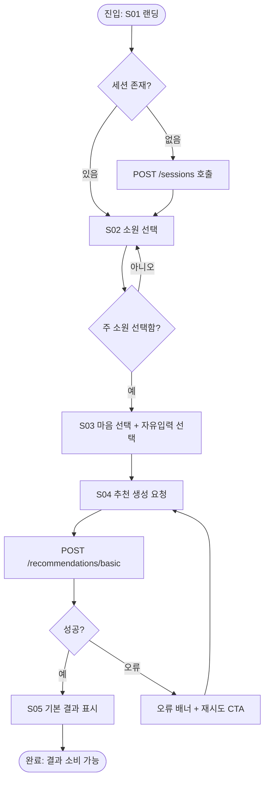
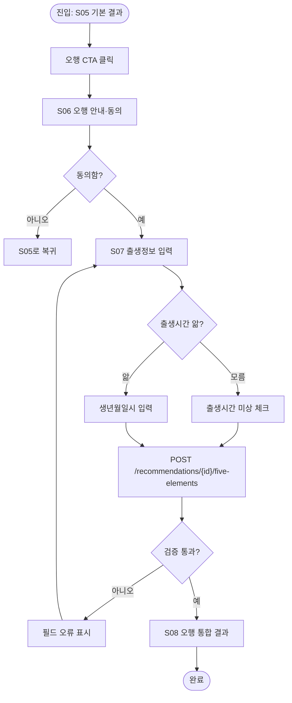
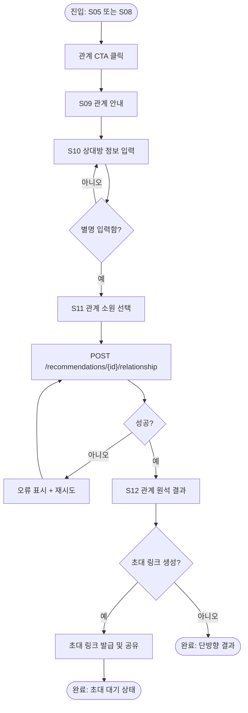
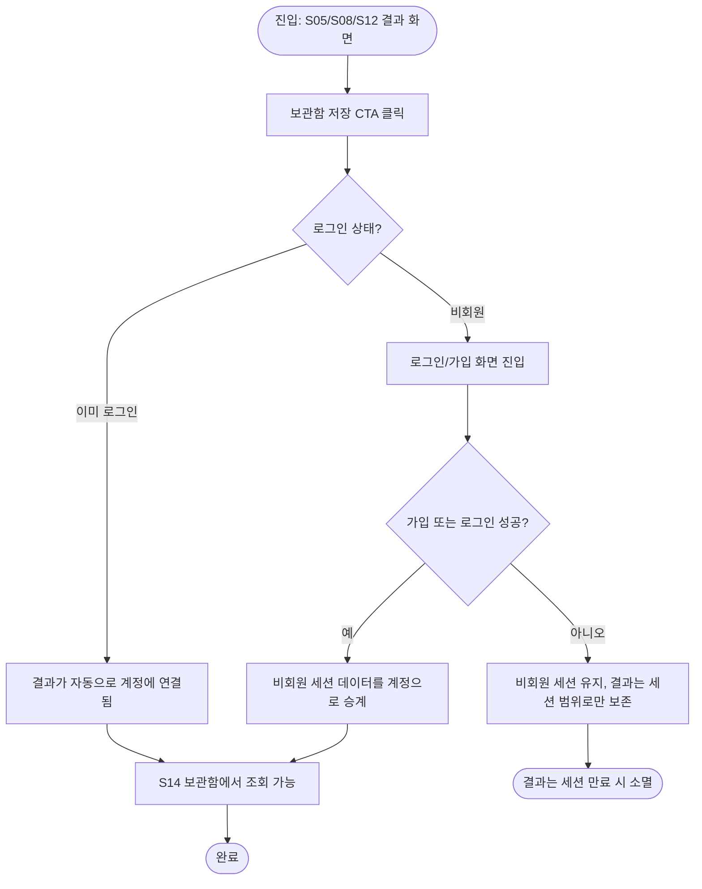
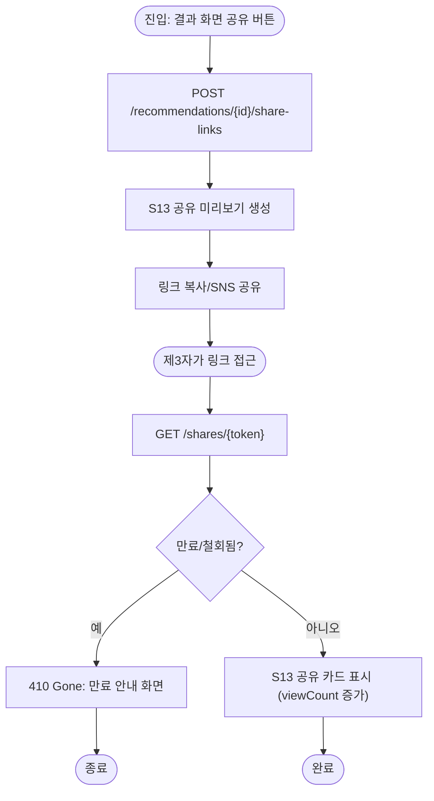
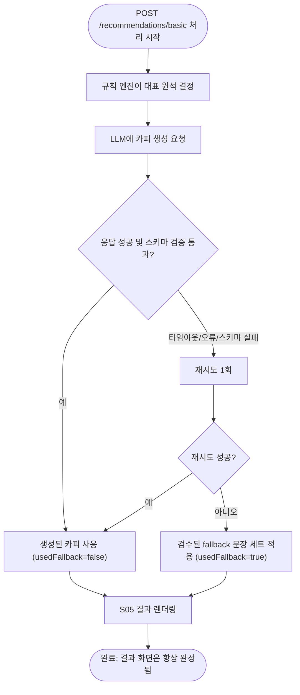
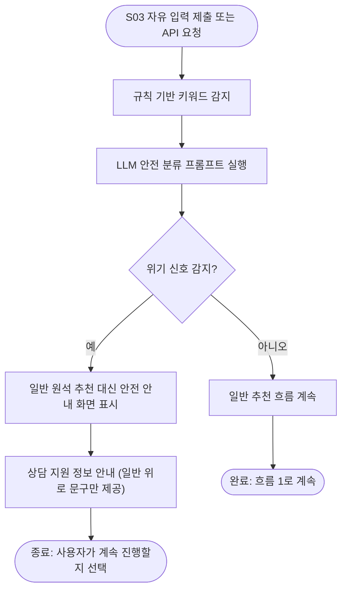
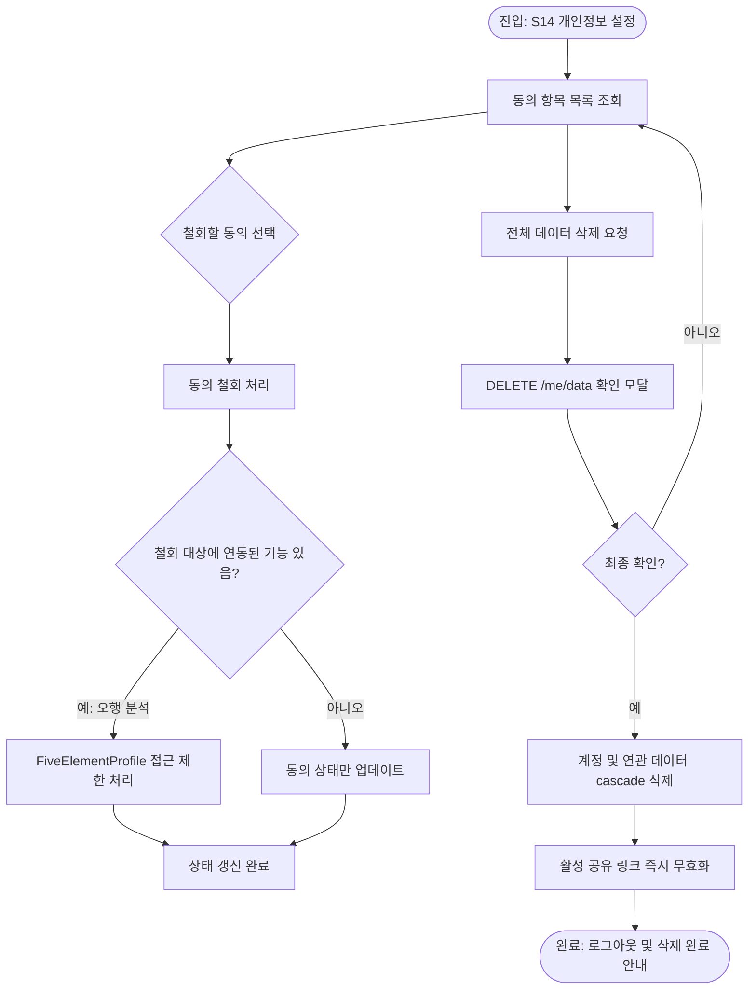

# 03. 사용자 흐름 — 원석 큐레이터

- 문서 버전: 0.1.0
- 최종 수정일: 2026-09-11 (Asia/Seoul)
- 상태: Draft

화면 ID는 [04-screen-specifications.md](04-screen-specifications.md), API는 [07-api-specification.md](07-api-specification.md), 분석 이벤트 allowlist는 [12-privacy-security-compliance.md](12-privacy-security-compliance.md#분석-이벤트-allowlist)를 참조한다.

## 1. 비회원 기본 원석 추천

- **진입 조건**: 신규 방문 또는 세션 만료 후 재방문.
- **정상 경로**: S01 → S02 → S03 → S04 → S05.
- **분기**: 주 소원 미선택 시 다음 단계 비활성화, 자유 입력은 선택 사항.
- **오류 경로**: `POST /recommendations/basic` 실패(네트워크 오류) 시 재시도 CTA 노출. LLM 실패는 오류가 아니라 fallback으로 처리되어 정상 경로로 간주(흐름 6 참조).
- **완료 조건**: S05에 `stone`, `heartSummary`, `rationale`, `comfortLines`, `microAction`이 모두 렌더링됨.
- **분석 이벤트**: `landing_view`, `wish_selected`, `heart_selected`, `recommendation_requested`, `recommendation_view`.

## 2. 기본 결과 이후 오행 분석

- **진입 조건**: S05에서 오행 CTA 클릭.
- **정상 경로**: S05 → S06 → S07 → S08.
- **분기**: 출생시간 미상 시 시주 제외 분석(FR-FIVE-003). 동의 거부 시 S05로 복귀.
- **오류 경로**: 생년월일 형식 오류, 미래 날짜 등 입력 검증 실패 시 S07에서 필드 오류 표시.
- **완료 조건**: `FiveElementProfile`이 생성되고 `balanceJson`, `computedElement`, `integratedStone`이 S08에 렌더링됨.
- **분석 이벤트**: `five_elements_cta_click`, `five_elements_consent_granted`, `five_elements_consent_denied`, `birth_info_submitted`(값 자체는 미포함, 제출 여부만), `five_elements_result_view`.

## 3. 관계 원석 추천

- **진입 조건**: S05 또는 S08에서 관계 CTA 클릭.
- **정상 경로**: S09 → S10 → S11 → S12.
- **분기**: 상대방 출생정보는 선택 입력이며 미입력 시 상대의 원석은 별명 기반 최소 정보로만 산출되거나 생략된다(FR-REL-002/003). 초대 링크 생성 여부는 선택.
- **오류 경로**: 별명 미입력 시 다음 단계 비활성화. API 실패 시 재시도.
- **완료 조건**: `RelationshipAnalysis`가 생성되고 최소한 `myStone`, `weStone`이 S12에 렌더링됨.
- **분석 이벤트**: `relationship_cta_click`, `relationship_type_selected`, `relationship_wish_selected`, `relationship_result_view`, `invite_link_created`.

## 4. 결과 저장 및 로그인

- **진입 조건**: 결과 화면에서 저장 CTA 클릭.
- **정상 경로**: 로그인 성공 → `AnonymousSession.convertedUserId` 연결 → 세션에 귀속된 `WishSession`/`Recommendation`이 사용자 소유로 전환.
- **분기**: 이미 로그인된 사용자는 즉시 저장.
- **오류 경로**: 가입/로그인 실패 시 비회원 세션 유지, 데이터는 세션 만료 정책에 따라 소멸(FR-BASIC-013 비회원 우선 원칙 유지).
- **완료 조건**: `GET /me/recommendations`에 해당 결과가 노출됨.
- **분석 이벤트**: `save_cta_click`, `signup_started`, `signup_completed`, `session_claimed`.

## 5. 결과 공유와 링크 만료

- **진입 조건**: 결과 화면에서 공유 버튼 클릭.
- **정상 경로**: 토큰 발급 → 공유 → 제3자 조회.
- **분기**: 소유자는 `DELETE /share-links/{token}`으로 언제든 철회 가능.
- **오류 경로**: 만료·철회된 토큰 접근 시 410 응답, S13은 만료 안내로 전환.
- **완료 조건**: 공유 payload에 개인정보 필드가 없음(원석, 요약 카피, 태그만 노출).
- **분석 이벤트**: `share_link_created`, `share_link_viewed`, `share_link_revoked`.

## 6. AI 실패 시 fallback

- **진입 조건**: 기본 추천 API 처리 중.
- **정상 경로**: LLM 성공 시 생성 카피 사용.
- **분기/오류 경로**: 실패 시 1회 재시도 후에도 실패하면 원석별로 검수된 fallback 문장([09-ai-prompts-and-safety.md](09-ai-prompts-and-safety.md#fallback-문장-템플릿)) 사용.
- **완료 조건**: 사용자에게는 항상 완성된 결과가 노출되며, `usedFallback` 플래그로 내부 관측만 구분한다(UI에 실패 여부를 노출하지 않음).
- **분석 이벤트**: `llm_generation_success`, `llm_generation_fallback_used`(개인정보 미포함, 원인 코드만 포함).

## 7. 위기 표현 감지와 안전 안내

- **진입 조건**: S03 자유 입력 제출 시 또는 추천 생성 API 처리 시.
- **정상 경로**: 위기 신호 없음 → 일반 흐름 계속.
- **분기**: 규칙 기반 키워드 매칭과 LLM 안전 분류가 이중으로 동작하며 둘 중 하나라도 위기로 판단하면 안전 경로로 라우팅한다.
- **오류 경로**: 안전 분류 자체가 실패(타임아웃 등)하면 보수적으로 규칙 기반 키워드 결과만으로 판단하며, 규칙 기반도 실패 시 안전 경로를 우선한다(fail-safe).
- **완료 조건**: 위기 신호 감지 시 원석 추천을 생성하지 않고 안전 안내만 제공한다(AI 금지행위, [09-ai-prompts-and-safety.md](09-ai-prompts-and-safety.md) 참조).
- **분석 이벤트**: `safety_flag_triggered`(원문 미포함, 트리거 유형 코드만), `safety_guidance_view`.

## 8. 개인정보 동의 철회 및 삭제

- **진입 조건**: 로그인한 회원이 S14 진입.
- **정상 경로**: 개별 동의 철회 또는 전체 데이터 삭제.
- **분기**: 오행 동의 철회 시 `FiveElementProfile` 접근을 제한하되, [12-privacy-security-compliance.md](12-privacy-security-compliance.md#보유·파기-정책)에 정의된 보유기간 내 삭제 처리. 전체 삭제는 되돌릴 수 없음을 확인 모달에서 고지.
- **오류 경로**: 삭제 처리 중 실패 시 재시도 안내, 부분 실패 없이 트랜잭션 단위로 처리.
- **완료 조건**: 삭제 후 `GET /me/recommendations`, `GET /shares/{token}`(해당 사용자 소유 링크) 모두 접근 불가.
- **분석 이벤트**: `consent_revoked`, `data_deletion_requested`, `data_deletion_completed`.

## Assumptions

- 흐름 4(저장/로그인)의 가입 방식은 이메일/소셜 여부를 특정하지 않고 중립적으로 표현했다.
- 흐름 7의 규칙 기반 키워드 목록 자체는 [09-ai-prompts-and-safety.md](09-ai-prompts-and-safety.md)에서 관리하며 본 문서는 라우팅 로직만 다룬다.

## 추가 검증 필요

- 위기 표현 감지 이중 안전망의 실제 정확도(한국어 기준)는 [13-decisions-and-open-questions.md](13-decisions-and-open-questions.md)의 미해결 항목 참조.
