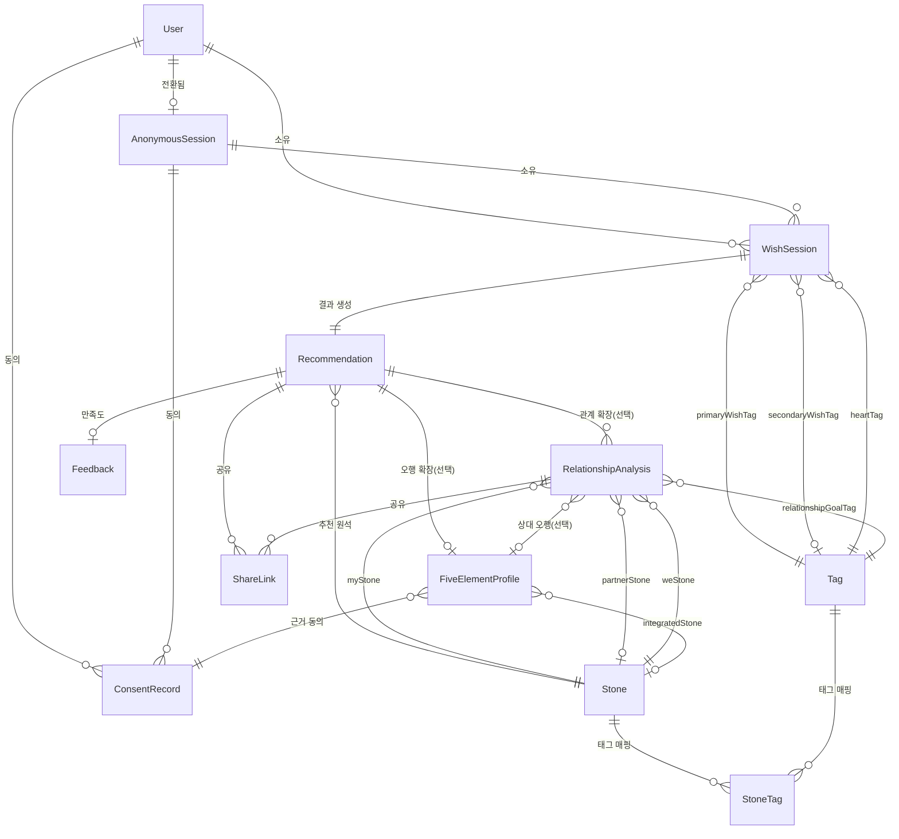

# 06. 데이터베이스 스키마 — 원석 큐레이터

- 문서 버전: 0.2.0
- 최종 수정일: 2026-09-12 (Asia/Seoul)
- 상태: Draft — 이 문서는 원본 설계이며, Phase 1~3 실제 구현과의 차이는 [11-implementation-roadmap.md](11-implementation-roadmap.md#실제-구현-참고-phase-1-착수-후-확정된-사항)에 기록한다.

DB는 PostgreSQL, ORM은 Prisma(v7, `prisma.config.ts` + `@prisma/adapter-pg` 드라이버 어댑터 구조)를 사용한다. 시간은 모두 UTC로 저장하고 사용자 표시 시점에 Asia/Seoul로 변환한다. API 필드 매핑은 [07-api-specification.md](07-api-specification.md), 추천 엔진 타입과의 정합은 [08-recommendation-engine.md](08-recommendation-engine.md)를 참조한다. 정확한 패키지·DB 버전은 `추가 검증 필요`(lockfile에 고정, [13-decisions-and-open-questions.md](13-decisions-and-open-questions.md) 참조).

**Phase 1~3 구현 시점의 실제 스키마 차이 (요약, 상세는 `prisma/schema.prisma`가 최종 근거)**:
- `User` 모델은 아직 생성하지 않았다(계정/로그인을 만들지 않기로 확정, [13-decisions-and-open-questions.md](13-decisions-and-open-questions.md) 참조). `ConsentRecord`는 `anonymousSessionId`만 가지며 `userId`는 없다.
- `FiveElementProfile`에는 원안에 없던 `isLeapMonth`(윤달 여부) 필드와, S08 결과 화면을 위한 `heartSummary`/`rationale`/`comfortLines`/`microAction`/`usedFallback`/`promptVersion`/`modelName` 카피 필드가 추가됐다(원안은 API 응답에 `rationale` 한 줄만 예시로 들었으나, `Recommendation`과 동일한 전체 카피 구조로 통일했다). **Phase 3에서 이 카피 필드들은 모두 nullable로 변경됐다**: 본인 오행(S08) 결과에서만 채워지고, 관계 원석(Phase 3)의 상대방 오행 프로필은 화면에 노출되는 별도 카피가 없어 LLM을 호출하지 않고 `null`로 남긴다(불필요한 LLM 호출 방지).
- `ShareLink`는 `scope`(`"basic" | "five-elements" | "relationship"`) 문자열 컬럼으로 같은 `Recommendation`의 어느 결과를 공유하는지 구분하는 방식을 Phase 3까지 그대로 유지했다(원안의 다형성 CHECK 제약 대신). `relationshipAnalysisId`(nullable, `ON DELETE CASCADE`) 컬럼을 추가해 `scope === "relationship"`일 때만 채운다.
- `RelationshipAnalysis`는 원안과 동일한 목적이지만 관계 유형(`relationshipType`)을 원석 점수화 신호로 쓰지 않는다([08-recommendation-engine.md](08-recommendation-engine.md#신호별-가중치-초기-휴리스틱-추가-검증-필요) 참조) — 스키마 컬럼 자체는 LLM 카피 맥락 입력 및 표시용으로 그대로 유지한다. `myStoneId`/`weStoneId`는 `ON DELETE RESTRICT`, `partnerStoneId`/`partnerFiveElementProfileId`는 `ON DELETE SET NULL`, `recommendationId`는 `ON DELETE CASCADE`다.
- 원안의 `status`(`RelationshipStatus` enum: `PENDING_PARTNER`/`COMPLETED`) 컬럼은 구현하지 않았다. 한때 상대방 출생정보를 선택 입력으로 두고 `inviteTokenHash`(nullable, unique)/`inviteExpiresAt`(nullable) 컬럼으로 비동기 초대 흐름을 지원했으나, 상대방 출생정보를 필수로 바꾸면서(FR-REL-002) 초대 흐름 자체가 도달 불가능해져 두 컬럼과 관련 기능을 모두 제거했다(마이그레이션 `20260913232442_drop_relationship_invite`, [13-decisions-and-open-questions.md](13-decisions-and-open-questions.md) 참조). 이제 `partnerBirthProvided`는 요청 시점에 상대방 출생정보가 항상 함께 제출되므로 사실상 항상 `true`이고, `partnerStoneId`도 매 요청에서 항상 채워진다.

## 엔터티 목록 및 목적

| 엔터티 | 목적 |
|---|---|
| `User` | 회원 계정 |
| `AnonymousSession` | 비회원 세션, 회원 전환 이전 임시 식별자 |
| `Stone` | 원석 지식 모델(추천 대상) |
| `Tag` | 소원/감정/관계목표 태그(추천 입력 신호) |
| `StoneTag` | 원석-태그 친화도 가중치 조인 |
| `WishSession` | 한 번의 소원·마음 입력 세션 |
| `Recommendation` | 기본 추천 결과(원석 + AI 생성 카피) |
| `FiveElementProfile` | 오행 계산 결과(생년월일시는 암호화 저장) |
| `RelationshipAnalysis` | 관계 원석 결과 |
| `ConsentRecord` | 개인정보 동의 이력 |
| `Feedback` | 결과 만족도 |
| `ShareLink` | 공유 링크(토큰 해시) |

## ERD



## 테이블 상세

### User

| 컬럼 | 타입 | 제약 |
|---|---|---|
| `id` | `uuid` | PK, default `gen_random_uuid()` |
| `email` | `text` | UNIQUE, nullable(`추가 검증 필요`: 인증 방식 확정 전까지 nullable 유지) |
| `passwordHash` | `text` | nullable |
| `displayName` | `text` | nullable |
| `createdAt` | `timestamptz` | default `now()` |
| `updatedAt` | `timestamptz` | on update `now()` |

### AnonymousSession

| 컬럼 | 타입 | 제약 |
|---|---|---|
| `id` | `uuid` | PK |
| `sessionTokenHash` | `text` | UNIQUE, NOT NULL — 원문 토큰은 저장하지 않음 |
| `createdAt` | `timestamptz` | default `now()` |
| `lastSeenAt` | `timestamptz` | default `now()` |
| `expiresAt` | `timestamptz` | NOT NULL |
| `convertedUserId` | `uuid` | FK → `User.id`, nullable, ON DELETE SET NULL |

### Stone

| 컬럼 | 타입 | 제약 |
|---|---|---|
| `id` | `uuid` | PK |
| `slug` | `text` | UNIQUE, NOT NULL |
| `nameKo` | `text` | NOT NULL |
| `nameEn` | `text` | NOT NULL |
| `summary` | `text` | NOT NULL |
| `description` | `text` | NOT NULL |
| `colorHex` | `text` | NOT NULL |
| `imageUrl` | `text` | nullable |
| `element` | `FiveElement` (enum) | nullable |
| `isActive` | `boolean` | default `true` |
| `createdAt` / `updatedAt` | `timestamptz` | - |

인덱스: `slug`(unique), `element`(조회 최적화).

### Tag

| 컬럼 | 타입 | 제약 |
|---|---|---|
| `id` | `uuid` | PK |
| `slug` | `text` | UNIQUE |
| `category` | `TagCategory` (enum: `WISH`, `EMOTION`, `RELATIONSHIP_GOAL`) | NOT NULL |
| `labelKo` | `text` | NOT NULL |
| `createdAt` | `timestamptz` | - |

인덱스: `category`.

### StoneTag

| 컬럼 | 타입 | 제약 |
|---|---|---|
| `id` | `uuid` | PK |
| `stoneId` | `uuid` | FK → `Stone.id`, ON DELETE CASCADE |
| `tagId` | `uuid` | FK → `Tag.id`, ON DELETE CASCADE |
| `weight` | `real` | NOT NULL, 0.0~1.0 |

제약: UNIQUE(`stoneId`, `tagId`). 인덱스: `tagId`(점수 계산 시 태그 기준 조회).

### WishSession

| 컬럼 | 타입 | 제약 |
|---|---|---|
| `id` | `uuid` | PK |
| `anonymousSessionId` | `uuid` | FK → `AnonymousSession.id`, nullable, ON DELETE CASCADE |
| `userId` | `uuid` | FK → `User.id`, nullable, ON DELETE CASCADE |
| `primaryWishTagId` | `uuid` | FK → `Tag.id`, NOT NULL |
| `secondaryWishTagId` | `uuid` | FK → `Tag.id`, nullable |
| `heartTagId` | `uuid` | FK → `Tag.id`, NOT NULL |
| `freeTextProvided` | `boolean` | default `false` — 자유 입력 원문은 **저장하지 않으며**, 제공 여부만 boolean으로 기록 |
| `createdAt` | `timestamptz` | - |

제약: `anonymousSessionId`와 `userId` 중 정확히 하나는 NOT NULL(애플리케이션 레벨 검증, PostgreSQL `CHECK` 제약으로 이중 보장 가능).

### Recommendation

| 컬럼 | 타입 | 제약 |
|---|---|---|
| `id` | `uuid` | PK |
| `wishSessionId` | `uuid` | FK → `WishSession.id`, UNIQUE, ON DELETE CASCADE |
| `stoneId` | `uuid` | FK → `Stone.id`, NOT NULL |
| `fiveElementProfileId` | `uuid` | FK → `FiveElementProfile.id`, UNIQUE, nullable |
| `rulesetVersion` | `text` | NOT NULL — [08-recommendation-engine.md](08-recommendation-engine.md#ruleset-버전-관리) |
| `score` | `real` | NOT NULL — 내부 관측용, 공개 API 응답에는 미노출 |
| `heartSummary` | `text` | NOT NULL |
| `rationale` | `text` | NOT NULL |
| `comfortLines` | `jsonb` | NOT NULL, `string[]`(2~3개) |
| `microAction` | `text` | NOT NULL |
| `usedFallback` | `boolean` | default `false` |
| `promptVersion` | `text` | NOT NULL |
| `modelName` | `text` | NOT NULL |
| `generatedAt` | `timestamptz` | NOT NULL |
| `createdAt` | `timestamptz` | - |

인덱스: `stoneId`(집계용), `createdAt`(보관함 정렬).

### FiveElementProfile

| 컬럼 | 타입 | 제약 |
|---|---|---|
| `id` | `uuid` | PK |
| `birthDateEncrypted` | `bytea` | NOT NULL — envelope encryption 결과, 평문 저장 금지 |
| `calendarType` | `CalendarType` (enum: `SOLAR`, `LUNAR`) | NOT NULL |
| `birthTimeUnknown` | `boolean` | default `false` |
| `birthTimeEncrypted` | `bytea` | nullable — `birthTimeUnknown=true`이면 NULL |
| `computedElement` | `FiveElement` (enum: `WOOD`,`FIRE`,`EARTH`,`METAL`,`WATER`) | NOT NULL |
| `balanceJson` | `jsonb` | NOT NULL — 목화토금수 점수 분포(파생 데이터, 평문 저장 허용) |
| `integratedStoneId` | `uuid` | FK → `Stone.id`, nullable |
| `consentRecordId` | `uuid` | FK → `ConsentRecord.id`, NOT NULL |
| `createdAt` | `timestamptz` | - |

`Recommendation.fiveElementProfileId`(본인 오행)와 `RelationshipAnalysis.partnerFiveElementProfileId`(상대 오행) 양쪽에서 참조되는 독립 엔터티다.

### RelationshipAnalysis

| 컬럼 | 타입 | 제약 |
|---|---|---|
| `id` | `uuid` | PK |
| `recommendationId` | `uuid` | FK → `Recommendation.id`, NOT NULL, ON DELETE CASCADE |
| `relationshipType` | `RelationshipType` (enum: `FAMILY`,`FRIEND`,`ROMANTIC`,`COLLEAGUE`,`OTHER`) | NOT NULL |
| `relationshipGoalTagId` | `uuid` | FK → `Tag.id`, NOT NULL |
| `partnerNicknameEncrypted` | `bytea` | NOT NULL — envelope encryption |
| `partnerBirthProvided` | `boolean` | default `false` — 상대방 출생정보가 항상 필수로 바뀌면서 실제로는 항상 `true`(구현 참고) |
| `partnerFiveElementProfileId` | `uuid` | FK → `FiveElementProfile.id`, nullable(스키마상 nullable이나 매 요청에서 항상 채워진다) |
| `myStoneId` | `uuid` | FK → `Stone.id`, NOT NULL |
| `partnerStoneId` | `uuid` | FK → `Stone.id`, nullable(스키마상 nullable이나 매 요청에서 항상 채워진다) |
| `weStoneId` | `uuid` | FK → `Stone.id`, NOT NULL |
| `createdAt` | `timestamptz` | - |

`inviteTokenHash`/`inviteExpiresAt`/`status`(`RelationshipStatus`)는 초대 링크 기능과 함께 제거됐다(위 실제 구현 참고 참조).

### ConsentRecord

| 컬럼 | 타입 | 제약 |
|---|---|---|
| `id` | `uuid` | PK |
| `userId` | `uuid` | FK → `User.id`, nullable, ON DELETE CASCADE |
| `anonymousSessionId` | `uuid` | FK → `AnonymousSession.id`, nullable, ON DELETE CASCADE |
| `consentType` | `ConsentType` (enum: `FIVE_ELEMENTS_BIRTH_INFO`,`RELATIONSHIP_PARTNER_INFO`,`TERMS_OF_SERVICE`,`PRIVACY_POLICY`) | NOT NULL |
| `consentVersion` | `text` | NOT NULL — 예: `privacy-policy-2026-09-11` |
| `granted` | `boolean` | NOT NULL |
| `grantedAt` | `timestamptz` | nullable |
| `revokedAt` | `timestamptz` | nullable |
| `createdAt` | `timestamptz` | - |

### Feedback

| 컬럼 | 타입 | 제약 |
|---|---|---|
| `id` | `uuid` | PK |
| `recommendationId` | `uuid` | FK → `Recommendation.id`, UNIQUE, ON DELETE CASCADE |
| `rating` | `smallint` | NOT NULL, CHECK 1~5 |
| `comment` | `text` | nullable, 최대 500자(애플리케이션 검증) |
| `createdAt` | `timestamptz` | - |

### ShareLink

| 컬럼 | 타입 | 제약 |
|---|---|---|
| `id` | `uuid` | PK |
| `recommendationId` | `uuid` | FK → `Recommendation.id`, nullable, ON DELETE CASCADE |
| `relationshipAnalysisId` | `uuid` | FK → `RelationshipAnalysis.id`, nullable, ON DELETE CASCADE |
| `tokenHash` | `text` | UNIQUE, NOT NULL — SHA-256 해시, 원문은 발급 응답에만 1회 노출 |
| `expiresAt` | `timestamptz` | NOT NULL |
| `revokedAt` | `timestamptz` | nullable |
| `viewCount` | `integer` | default `0` |
| `createdAt` | `timestamptz` | - |

제약: `recommendationId`와 `relationshipAnalysisId` 중 정확히 하나만 NOT NULL(애플리케이션 레벨 검증).

## Cascade 및 삭제 정책

- `User`/`AnonymousSession` 삭제 시 하위 `WishSession` → `Recommendation` → `FiveElementProfile`/`RelationshipAnalysis`/`Feedback`/`ShareLink`까지 `ON DELETE CASCADE`로 연쇄 삭제된다.
- `Stone`, `Tag`는 참조 무결성 보호를 위해 사용 중인 레코드가 있으면 논리적 비활성화(`Stone.isActive=false`)만 허용하고 물리적 삭제는 관리자 전용 도구에서만 수행한다(`추가 검증 필요`: 운영 툴 설계).
- `ConsentRecord`는 철회(`revokedAt` 설정) 후에도 감사 목적상 즉시 삭제하지 않고 보유기간 종료 시 배치로 삭제한다.

## 데이터 보유기간

| 데이터 | 보유기간 | 비고 |
|---|---|---|
| `AnonymousSession` | 마지막 활동 후 30일(`추가 검증 필요`) | 만료 후 배치 삭제 |
| `FiveElementProfile.*Encrypted` | 계정 삭제 또는 동의 철회 시 즉시 삭제 | [12-privacy-security-compliance.md](12-privacy-security-compliance.md#보유·파기-정책) |
| `RelationshipAnalysis.partnerNicknameEncrypted` | 계정 삭제 또는 관계 결과 삭제 시 즉시 삭제 | 동일 |
| `ShareLink` | `expiresAt` 경과 후 접근 차단, 배치로 물리적 삭제(`추가 검증 필요`: 배치 주기) | - |
| `Feedback.comment` | 계정 삭제 시 삭제, 별도 단축 보유기간은 `추가 검증 필요` | - |
| `ConsentRecord` | 법정 보유기간(`추가 검증 필요`, 전자상거래법 등 검토 필요) | [12-privacy-security-compliance.md](12-privacy-security-compliance.md) |

## 암호화 필드

다음 필드는 평문 저장 및 로그 출력을 금지하며 application-level envelope encryption(DEK를 KMS 관리 KEK로 래핑)을 적용한다. 실제 KMS/암호화 라이브러리 선택은 `추가 검증 필요`.

- `FiveElementProfile.birthDateEncrypted`
- `FiveElementProfile.birthTimeEncrypted`
- `RelationshipAnalysis.partnerNicknameEncrypted`

세션/공유 토큰은 암호화 대상이 아니라 **단방향 해시**(SHA-256 이상) 저장 대상이며, 자유 입력(`freeText`)은 애초에 DB에 저장하지 않는다.

## 공유 토큰 해시 정책

- 토큰은 발급 시 서버에서 암호학적으로 안전한 난수로 생성하고, 클라이언트에는 원문을 1회 응답으로만 전달한다.
- DB에는 `SHA-256(token)` 해시만 `tokenHash`/`sessionTokenHash` 컬럼에 저장한다.
- 조회 시 요청받은 토큰을 동일 방식으로 해시하여 비교한다(타이밍 공격 방지를 위한 상수시간 비교 적용, `추가 검증 필요`: 구현 라이브러리).

## 개인정보 최소수집 원칙

- 자유 입력(최대 300자)은 LLM 요청에만 사용되고 DB에 저장하지 않는다.
- 생년월일시, 상대방 별명은 오행/관계 기능 이용에 필수적인 최소 정보만 수집하며 암호화 저장한다.
- 분석 이벤트와 공유 payload에는 위 암호화 필드가 포함되지 않는다([12-privacy-security-compliance.md](12-privacy-security-compliance.md#분석-이벤트-allowlist)).

## Prisma Schema 초안

```prisma
generator client {
  provider = "prisma-client-js"
}

datasource db {
  provider = "postgresql"
  url      = env("DATABASE_URL")
}

enum FiveElement {
  WOOD
  FIRE
  EARTH
  METAL
  WATER
}

enum CalendarType {
  SOLAR
  LUNAR
}

enum TagCategory {
  WISH
  EMOTION
  RELATIONSHIP_GOAL
}

enum RelationshipType {
  FAMILY
  FRIEND
  ROMANTIC
  COLLEAGUE
  OTHER
}

enum ConsentType {
  FIVE_ELEMENTS_BIRTH_INFO
  RELATIONSHIP_PARTNER_INFO
  TERMS_OF_SERVICE
  PRIVACY_POLICY
}

model User {
  id            String             @id @default(uuid()) @db.Uuid
  email         String?            @unique
  passwordHash  String?
  displayName   String?
  createdAt     DateTime           @default(now())
  updatedAt     DateTime           @updatedAt

  anonymousSessions AnonymousSession[]
  wishSessions      WishSession[]
  consentRecords    ConsentRecord[]
}

model AnonymousSession {
  id                String    @id @default(uuid()) @db.Uuid
  sessionTokenHash  String    @unique
  createdAt         DateTime  @default(now())
  lastSeenAt        DateTime  @default(now())
  expiresAt         DateTime
  convertedUserId   String?   @db.Uuid
  convertedUser     User?     @relation(fields: [convertedUserId], references: [id], onDelete: SetNull)

  wishSessions      WishSession[]
  consentRecords    ConsentRecord[]
}

model Stone {
  id          String        @id @default(uuid()) @db.Uuid
  slug        String        @unique
  nameKo      String
  nameEn      String
  summary     String
  description String
  colorHex    String
  imageUrl    String?
  element     FiveElement?
  isActive    Boolean       @default(true)
  createdAt   DateTime      @default(now())
  updatedAt   DateTime      @updatedAt

  stoneTags               StoneTag[]
  recommendations         Recommendation[]       @relation("RecommendationStone")
  fiveElementProfiles     FiveElementProfile[]    @relation("IntegratedStone")
  myStoneRelationships    RelationshipAnalysis[]  @relation("MyStone")
  partnerStoneRelationships RelationshipAnalysis[] @relation("PartnerStone")
  weStoneRelationships    RelationshipAnalysis[]  @relation("WeStone")
}

model Tag {
  id        String       @id @default(uuid()) @db.Uuid
  slug      String       @unique
  category  TagCategory
  labelKo   String
  createdAt DateTime     @default(now())

  stoneTags                 StoneTag[]
  primaryWishSessions        WishSession[]          @relation("PrimaryWish")
  secondaryWishSessions      WishSession[]          @relation("SecondaryWish")
  heartWishSessions          WishSession[]          @relation("HeartTag")
  relationshipGoalAnalyses   RelationshipAnalysis[]  @relation("RelationshipGoal")
}

model StoneTag {
  id       String  @id @default(uuid()) @db.Uuid
  stoneId  String  @db.Uuid
  tagId    String  @db.Uuid
  weight   Float

  stone Stone @relation(fields: [stoneId], references: [id], onDelete: Cascade)
  tag   Tag   @relation(fields: [tagId], references: [id], onDelete: Cascade)

  @@unique([stoneId, tagId])
  @@index([tagId])
}

model WishSession {
  id                  String    @id @default(uuid()) @db.Uuid
  anonymousSessionId  String?   @db.Uuid
  userId              String?   @db.Uuid
  primaryWishTagId    String    @db.Uuid
  secondaryWishTagId  String?   @db.Uuid
  heartTagId          String    @db.Uuid
  freeTextProvided    Boolean   @default(false)
  createdAt           DateTime  @default(now())

  anonymousSession  AnonymousSession? @relation(fields: [anonymousSessionId], references: [id], onDelete: Cascade)
  user              User?             @relation(fields: [userId], references: [id], onDelete: Cascade)
  primaryWishTag    Tag   @relation("PrimaryWish", fields: [primaryWishTagId], references: [id])
  secondaryWishTag  Tag?  @relation("SecondaryWish", fields: [secondaryWishTagId], references: [id])
  heartTag          Tag   @relation("HeartTag", fields: [heartTagId], references: [id])
  recommendation    Recommendation?

  @@index([anonymousSessionId])
  @@index([userId])
}

model Recommendation {
  id                    String    @id @default(uuid()) @db.Uuid
  wishSessionId         String    @unique @db.Uuid
  stoneId               String    @db.Uuid
  fiveElementProfileId  String?   @unique @db.Uuid
  rulesetVersion        String
  score                 Float
  heartSummary          String
  rationale             String
  comfortLines          Json
  microAction           String
  usedFallback          Boolean   @default(false)
  promptVersion         String
  modelName              String
  generatedAt            DateTime
  createdAt               DateTime  @default(now())

  wishSession         WishSession          @relation(fields: [wishSessionId], references: [id], onDelete: Cascade)
  stone               Stone                @relation("RecommendationStone", fields: [stoneId], references: [id])
  fiveElementProfile  FiveElementProfile?  @relation("PrimaryFiveElementProfile", fields: [fiveElementProfileId], references: [id])
  relationshipAnalyses RelationshipAnalysis[]
  feedback            Feedback?
  shareLinks          ShareLink[]

  @@index([stoneId])
  @@index([createdAt])
}

model FiveElementProfile {
  id                   String        @id @default(uuid()) @db.Uuid
  birthDateEncrypted   Bytes
  calendarType         CalendarType
  birthTimeUnknown     Boolean       @default(false)
  birthTimeEncrypted   Bytes?
  computedElement      FiveElement
  balanceJson          Json
  integratedStoneId    String?       @db.Uuid
  consentRecordId      String        @db.Uuid
  createdAt            DateTime      @default(now())

  integratedStone   Stone?          @relation("IntegratedStone", fields: [integratedStoneId], references: [id])
  consentRecord     ConsentRecord   @relation(fields: [consentRecordId], references: [id])
  ownedByRecommendation  Recommendation?      @relation("PrimaryFiveElementProfile")
  usedByRelationship     RelationshipAnalysis[] @relation("PartnerFiveElementProfile")
}

model RelationshipAnalysis {
  id                            String              @id @default(uuid()) @db.Uuid
  recommendationId              String              @db.Uuid
  relationshipType              RelationshipType
  relationshipGoalTagId         String              @db.Uuid
  partnerNicknameEncrypted      Bytes
  partnerBirthProvided          Boolean             @default(false)
  partnerFiveElementProfileId   String?             @db.Uuid
  myStoneId                     String              @db.Uuid
  partnerStoneId                String?             @db.Uuid
  weStoneId                     String              @db.Uuid
  createdAt                     DateTime            @default(now())

  recommendation             Recommendation        @relation(fields: [recommendationId], references: [id], onDelete: Cascade)
  relationshipGoalTag        Tag                    @relation("RelationshipGoal", fields: [relationshipGoalTagId], references: [id])
  partnerFiveElementProfile  FiveElementProfile?    @relation("PartnerFiveElementProfile", fields: [partnerFiveElementProfileId], references: [id])
  myStone                    Stone                  @relation("MyStone", fields: [myStoneId], references: [id])
  partnerStone               Stone?                 @relation("PartnerStone", fields: [partnerStoneId], references: [id])
  weStone                    Stone                  @relation("WeStone", fields: [weStoneId], references: [id])
  shareLinks                 ShareLink[]

  @@index([recommendationId])
}

model ConsentRecord {
  id                  String       @id @default(uuid()) @db.Uuid
  userId              String?      @db.Uuid
  anonymousSessionId  String?      @db.Uuid
  consentType         ConsentType
  consentVersion      String
  granted             Boolean
  grantedAt           DateTime?
  revokedAt           DateTime?
  createdAt           DateTime     @default(now())

  user               User?               @relation(fields: [userId], references: [id], onDelete: Cascade)
  anonymousSession   AnonymousSession?   @relation(fields: [anonymousSessionId], references: [id], onDelete: Cascade)
  fiveElementProfiles FiveElementProfile[]

  @@index([userId])
  @@index([anonymousSessionId])
}

model Feedback {
  id                String    @id @default(uuid()) @db.Uuid
  recommendationId  String    @unique @db.Uuid
  rating            Int
  comment           String?
  createdAt         DateTime  @default(now())

  recommendation Recommendation @relation(fields: [recommendationId], references: [id], onDelete: Cascade)
}

model ShareLink {
  id                      String    @id @default(uuid()) @db.Uuid
  recommendationId        String?   @db.Uuid
  relationshipAnalysisId  String?   @db.Uuid
  tokenHash               String    @unique
  expiresAt               DateTime
  revokedAt               DateTime?
  viewCount               Int       @default(0)
  createdAt               DateTime  @default(now())

  recommendation       Recommendation?        @relation(fields: [recommendationId], references: [id], onDelete: Cascade)
  relationshipAnalysis RelationshipAnalysis?   @relation(fields: [relationshipAnalysisId], references: [id], onDelete: Cascade)

  @@index([expiresAt])
}
```

## PostgreSQL Migration 초안

Prisma가 마이그레이션을 자동 생성하므로 아래는 구조 이해를 돕기 위한 수기 DDL 요약이며, 실제 마이그레이션 파일은 `prisma migrate dev`로 생성한다(`추가 검증 필요`: 초기 마이그레이션 실행은 Phase 1 구현 단계에서 수행, 본 문서 작성 단계에서는 실행하지 않음).

```sql
CREATE EXTENSION IF NOT EXISTS pgcrypto;

CREATE TYPE "FiveElement" AS ENUM ('WOOD','FIRE','EARTH','METAL','WATER');
CREATE TYPE "CalendarType" AS ENUM ('SOLAR','LUNAR');
CREATE TYPE "TagCategory" AS ENUM ('WISH','EMOTION','RELATIONSHIP_GOAL');
CREATE TYPE "RelationshipType" AS ENUM ('FAMILY','FRIEND','ROMANTIC','COLLEAGUE','OTHER');
CREATE TYPE "ConsentType" AS ENUM ('FIVE_ELEMENTS_BIRTH_INFO','RELATIONSHIP_PARTNER_INFO','TERMS_OF_SERVICE','PRIVACY_POLICY');

CREATE TABLE "User" (
  id UUID PRIMARY KEY DEFAULT gen_random_uuid(),
  email TEXT UNIQUE,
  "passwordHash" TEXT,
  "displayName" TEXT,
  "createdAt" TIMESTAMPTZ NOT NULL DEFAULT now(),
  "updatedAt" TIMESTAMPTZ NOT NULL DEFAULT now()
);

CREATE TABLE "AnonymousSession" (
  id UUID PRIMARY KEY DEFAULT gen_random_uuid(),
  "sessionTokenHash" TEXT UNIQUE NOT NULL,
  "createdAt" TIMESTAMPTZ NOT NULL DEFAULT now(),
  "lastSeenAt" TIMESTAMPTZ NOT NULL DEFAULT now(),
  "expiresAt" TIMESTAMPTZ NOT NULL,
  "convertedUserId" UUID REFERENCES "User"(id) ON DELETE SET NULL
);

CREATE TABLE "Stone" (
  id UUID PRIMARY KEY DEFAULT gen_random_uuid(),
  slug TEXT UNIQUE NOT NULL,
  "nameKo" TEXT NOT NULL,
  "nameEn" TEXT NOT NULL,
  summary TEXT NOT NULL,
  description TEXT NOT NULL,
  "colorHex" TEXT NOT NULL,
  "imageUrl" TEXT,
  element "FiveElement",
  "isActive" BOOLEAN NOT NULL DEFAULT true,
  "createdAt" TIMESTAMPTZ NOT NULL DEFAULT now(),
  "updatedAt" TIMESTAMPTZ NOT NULL DEFAULT now()
);

CREATE TABLE "Tag" (
  id UUID PRIMARY KEY DEFAULT gen_random_uuid(),
  slug TEXT UNIQUE NOT NULL,
  category "TagCategory" NOT NULL,
  "labelKo" TEXT NOT NULL,
  "createdAt" TIMESTAMPTZ NOT NULL DEFAULT now()
);

CREATE TABLE "StoneTag" (
  id UUID PRIMARY KEY DEFAULT gen_random_uuid(),
  "stoneId" UUID NOT NULL REFERENCES "Stone"(id) ON DELETE CASCADE,
  "tagId" UUID NOT NULL REFERENCES "Tag"(id) ON DELETE CASCADE,
  weight REAL NOT NULL,
  UNIQUE ("stoneId", "tagId")
);
CREATE INDEX ON "StoneTag" ("tagId");

CREATE TABLE "WishSession" (
  id UUID PRIMARY KEY DEFAULT gen_random_uuid(),
  "anonymousSessionId" UUID REFERENCES "AnonymousSession"(id) ON DELETE CASCADE,
  "userId" UUID REFERENCES "User"(id) ON DELETE CASCADE,
  "primaryWishTagId" UUID NOT NULL REFERENCES "Tag"(id),
  "secondaryWishTagId" UUID REFERENCES "Tag"(id),
  "heartTagId" UUID NOT NULL REFERENCES "Tag"(id),
  "freeTextProvided" BOOLEAN NOT NULL DEFAULT false,
  "createdAt" TIMESTAMPTZ NOT NULL DEFAULT now(),
  CHECK (("anonymousSessionId" IS NOT NULL) <> ("userId" IS NOT NULL) OR ("anonymousSessionId" IS NOT NULL AND "userId" IS NOT NULL))
);
CREATE INDEX ON "WishSession" ("anonymousSessionId");
CREATE INDEX ON "WishSession" ("userId");

CREATE TABLE "FiveElementProfile" (
  id UUID PRIMARY KEY DEFAULT gen_random_uuid(),
  "birthDateEncrypted" BYTEA NOT NULL,
  "calendarType" "CalendarType" NOT NULL,
  "birthTimeUnknown" BOOLEAN NOT NULL DEFAULT false,
  "birthTimeEncrypted" BYTEA,
  "computedElement" "FiveElement" NOT NULL,
  "balanceJson" JSONB NOT NULL,
  "integratedStoneId" UUID REFERENCES "Stone"(id),
  "consentRecordId" UUID NOT NULL,
  "createdAt" TIMESTAMPTZ NOT NULL DEFAULT now()
);

CREATE TABLE "Recommendation" (
  id UUID PRIMARY KEY DEFAULT gen_random_uuid(),
  "wishSessionId" UUID UNIQUE NOT NULL REFERENCES "WishSession"(id) ON DELETE CASCADE,
  "stoneId" UUID NOT NULL REFERENCES "Stone"(id),
  "fiveElementProfileId" UUID UNIQUE REFERENCES "FiveElementProfile"(id),
  "rulesetVersion" TEXT NOT NULL,
  score REAL NOT NULL,
  "heartSummary" TEXT NOT NULL,
  rationale TEXT NOT NULL,
  "comfortLines" JSONB NOT NULL,
  "microAction" TEXT NOT NULL,
  "usedFallback" BOOLEAN NOT NULL DEFAULT false,
  "promptVersion" TEXT NOT NULL,
  "modelName" TEXT NOT NULL,
  "generatedAt" TIMESTAMPTZ NOT NULL,
  "createdAt" TIMESTAMPTZ NOT NULL DEFAULT now()
);
CREATE INDEX ON "Recommendation" ("stoneId");
CREATE INDEX ON "Recommendation" ("createdAt");

CREATE TABLE "RelationshipAnalysis" (
  id UUID PRIMARY KEY DEFAULT gen_random_uuid(),
  "recommendationId" UUID NOT NULL REFERENCES "Recommendation"(id) ON DELETE CASCADE,
  "relationshipType" "RelationshipType" NOT NULL,
  "relationshipGoalTagId" UUID NOT NULL REFERENCES "Tag"(id),
  "partnerNicknameEncrypted" BYTEA NOT NULL,
  "partnerBirthProvided" BOOLEAN NOT NULL DEFAULT false,
  "partnerFiveElementProfileId" UUID REFERENCES "FiveElementProfile"(id),
  "myStoneId" UUID NOT NULL REFERENCES "Stone"(id),
  "partnerStoneId" UUID REFERENCES "Stone"(id),
  "weStoneId" UUID NOT NULL REFERENCES "Stone"(id),
  "createdAt" TIMESTAMPTZ NOT NULL DEFAULT now()
);
CREATE INDEX ON "RelationshipAnalysis" ("recommendationId");

CREATE TABLE "ConsentRecord" (
  id UUID PRIMARY KEY DEFAULT gen_random_uuid(),
  "userId" UUID REFERENCES "User"(id) ON DELETE CASCADE,
  "anonymousSessionId" UUID REFERENCES "AnonymousSession"(id) ON DELETE CASCADE,
  "consentType" "ConsentType" NOT NULL,
  "consentVersion" TEXT NOT NULL,
  granted BOOLEAN NOT NULL,
  "grantedAt" TIMESTAMPTZ,
  "revokedAt" TIMESTAMPTZ,
  "createdAt" TIMESTAMPTZ NOT NULL DEFAULT now()
);
CREATE INDEX ON "ConsentRecord" ("userId");
CREATE INDEX ON "ConsentRecord" ("anonymousSessionId");

ALTER TABLE "FiveElementProfile"
  ADD CONSTRAINT fk_five_element_consent FOREIGN KEY ("consentRecordId") REFERENCES "ConsentRecord"(id);

CREATE TABLE "Feedback" (
  id UUID PRIMARY KEY DEFAULT gen_random_uuid(),
  "recommendationId" UUID UNIQUE NOT NULL REFERENCES "Recommendation"(id) ON DELETE CASCADE,
  rating SMALLINT NOT NULL CHECK (rating BETWEEN 1 AND 5),
  comment TEXT,
  "createdAt" TIMESTAMPTZ NOT NULL DEFAULT now()
);

CREATE TABLE "ShareLink" (
  id UUID PRIMARY KEY DEFAULT gen_random_uuid(),
  "recommendationId" UUID REFERENCES "Recommendation"(id) ON DELETE CASCADE,
  "relationshipAnalysisId" UUID REFERENCES "RelationshipAnalysis"(id) ON DELETE CASCADE,
  "tokenHash" TEXT UNIQUE NOT NULL,
  "expiresAt" TIMESTAMPTZ NOT NULL,
  "revokedAt" TIMESTAMPTZ,
  "viewCount" INTEGER NOT NULL DEFAULT 0,
  "createdAt" TIMESTAMPTZ NOT NULL DEFAULT now(),
  CHECK (("recommendationId" IS NOT NULL) <> ("relationshipAnalysisId" IS NOT NULL))
);
CREATE INDEX ON "ShareLink" ("expiresAt");
```

## Seed 데이터 구조

- `prisma/seed.ts`(예정 경로)에서 다음 순서로 시드한다: `Tag`(카테고리별) → `Stone` → `StoneTag`(원석-태그 가중치, [08-recommendation-engine.md](08-recommendation-engine.md) 초기 가중치와 별개로 원석별 태그 친화도).
- 시드 데이터 소스는 `prisma/seed-data/*.json`(예정) 형태로 분리하여 전문가 검수본을 버전 관리한다(`추가 검증 필요`: 원석-태그 매핑의 전문가 검수, [13-decisions-and-open-questions.md](13-decisions-and-open-questions.md) 참조).

## 데이터 삭제 순서

`DELETE /me/data` 처리 시 애플리케이션 레벨에서 아래 순서로 처리하며, DB의 `ON DELETE CASCADE`가 상당 부분을 자동 처리하더라도 감사 로그·암호화 키 폐기를 위해 순서를 명시한다.

1. 사용자 소유 `ShareLink` 전체 무효화(`revokedAt` 설정 후 삭제)
2. `Feedback` 삭제
3. `RelationshipAnalysis` 삭제(연결된 `partnerFiveElementProfile`도 함께 삭제)
4. `FiveElementProfile`(본인 소유분) 삭제 및 관련 암호화 키 폐기
5. `Recommendation` 삭제
6. `WishSession` 삭제
7. `ConsentRecord` 삭제(법정 보유 의무가 있는 경우 익명화 후 보관, [12-privacy-security-compliance.md](12-privacy-security-compliance.md) 참조)
8. `AnonymousSession`(연결되어 있던 경우) 삭제
9. `User` 삭제

## Assumptions

- `WishSession`은 자유 입력 원문을 저장하지 않는 설계를 전제로 `freeTextProvided` boolean만 둔다.
- `Recommendation.score`는 내부 관측 전용이며 API 응답에는 노출하지 않는 것으로 가정했다.
- ~~`RelationshipAnalysis`와 `ShareLink`는 다형 참조(추천 또는 관계결과 중 하나) 패턴을 애플리케이션+CHECK 제약으로 처리하는 것으로 가정했다.~~ → 실제로는 CHECK 제약 없이 `ShareLink.scope` 문자열 컬럼 + nullable FK(`relationshipAnalysisId`) 조합으로 구현했다(Phase 2/3 실제 구현 참고 섹션 참조).

## 추가 검증 필요

- `ConsentRecord` 법정 보유기간(법무 확인 필요, [13-decisions-and-open-questions.md](13-decisions-and-open-questions.md) 참조)
- 원석-태그(`StoneTag`) 시드 데이터의 전문가 검수
- envelope encryption KEK의 실제 KMS 이전([13-decisions-and-open-questions.md](13-decisions-and-open-questions.md) 참조 — 암호화 알고리즘/라이브러리 자체는 AES-256-GCM(`node:crypto`)으로 이미 확정·구현됨)
- `AnonymousSession`/`ShareLink` 만료 배치를 실제 운영 스케줄러(cron 등)에 연결하는 인프라 작업(배치 스크립트 자체는 `npm run cleanup:sessions`로 구현됨, [13-decisions-and-open-questions.md](13-decisions-and-open-questions.md) 참조)

~~인증 방식 확정에 따른 `User` 테이블 필드 조정~~ → 계정/로그인 기능을 만들지 않기로 확정되어 `User` 테이블 자체가 없다([13-decisions-and-open-questions.md](13-decisions-and-open-questions.md) 참조).
