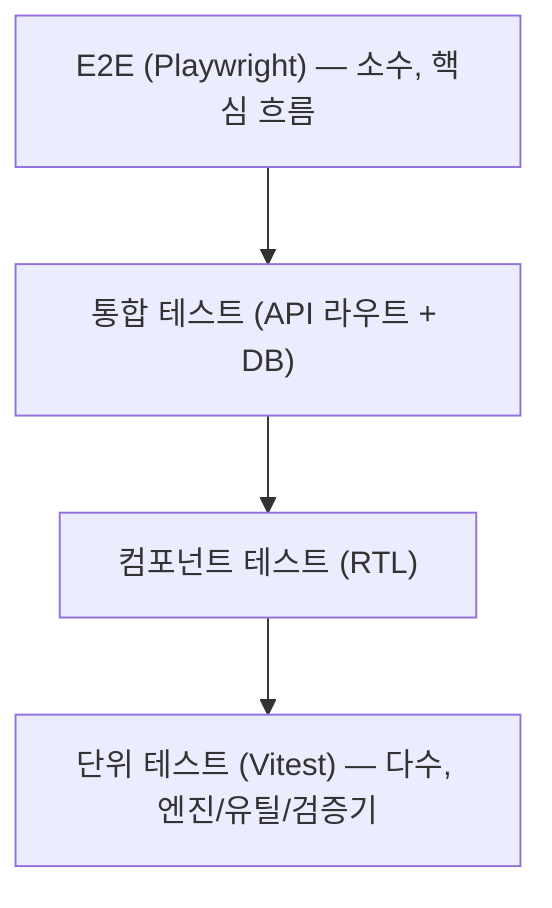

# 10. 테스트 및 수용 기준 — 원석 큐레이터

- 문서 버전: 0.1.0
- 최종 수정일: 2026-09-11 (Asia/Seoul)
- 상태: Draft

테스트 도구는 Vitest(단위/통합), React Testing Library(컴포넌트), Playwright(E2E)를 사용한다(정확한 버전은 [13-decisions-and-open-questions.md](13-decisions-and-open-questions.md) 참조).

## 테스트 피라미드



- **단위 테스트**: 추천 엔진 점수 계산, 가중치 재정규화, 출력 후 검증기, Zod 스키마, 유틸 함수.
- **통합 테스트**: API 라우트가 DB/추천 엔진/LLM Provider(모킹)와 함께 올바르게 동작하는지 검증.
- **E2E 테스트**: 실제 브라우저에서 핵심 사용자 흐름 검증.
- **속성 기반 테스트**: 추천 엔진 결정론, 가중치 합 불변식([08-recommendation-engine.md](08-recommendation-engine.md#속성-기반-테스트)).
- **접근성 테스트**: 자동화 도구(`추가 검증 필요`: axe-core 등 선택) + 키보드 전용 E2E.
- **보안 테스트**: rate limit, 토큰 해시 비교, 소유권 검증, 입력 sanitization.
- **프롬프트 회귀 테스트**: 안전 분류 fixture, 출력 후 검증기 대상 골든 케이스.
- **추천 결정론 테스트**: 동일 입력 N회 반복 시 동일 결과.
- **개인정보 비노출 테스트**: 공유/분석 payload에 민감 필드 부재 검증.

## 단위 테스트

| 영역 | 내용 |
|---|---|
| 추천 엔진 | [ENGINE-01~06](08-recommendation-engine.md#단위-테스트) |
| 출력 후 검증기 | 스키마 위반, 글자수 초과, 금지 표현 포함 시 fallback 전환 여부 |
| Zod 스키마 | [07-api-specification.md](07-api-specification.md)의 각 요청 스키마 boundary 값(300자, 20자, 1~5점 등) |
| 오행 계산 유틸 | 양력/음력 변환, 출생시간 미상 처리(`추가 검증 필요`: 계산 방식 확정 후 상세화) |
| 암호화 유틸 | envelope encryption/decryption 왕복 검증 |

## 통합 테스트

| 대상 API | 검증 내용 |
|---|---|
| `POST /sessions` | 세션 생성, 토큰 해시 저장, 원문 미저장 |
| `GET /catalog/wishes` | 카테고리별 태그 필터링 |
| `POST /recommendations/basic` | 규칙 엔진 호출 → LLM 호출(모킹) → 응답 조립, `freeText` 미저장 검증 |
| `GET /recommendations/{id}` | 소유권 검증(404 처리) |
| `POST /recommendations/{id}/five-elements` | 동의 기록, 암호화 저장, 출생시간 미상 분기 |
| `POST /recommendations/{id}/relationship` | 상대 출생정보 없는 경우 분기 |
| `POST /recommendations/{id}/feedback` | 중복 제출 시 `CONFLICT` |
| `POST /recommendations/{id}/share-links` | 토큰 발급/해시 저장 |
| `GET /shares/{token}` | 만료/철회 시 오류, payload 필드 allowlist 검증 |
| `DELETE /share-links/{token}` | 소유권 검증 |
| `GET /me/recommendations` | 페이지네이션 |
| `DELETE /me/data` | cascade 삭제, 삭제 후 관련 리소스 접근 불가 |

## E2E 테스트

Playwright 기준, 실제 브라우저(모바일 뷰포트 우선)에서 수행한다. LLM/외부 의존성은 테스트 환경에서 모킹하거나 결정론적 스텁을 사용한다(`추가 검증 필요`: 테스트 환경 LLM 모킹 전략).

| ID | 시나리오 |
|---|---|
| E2E-01 | 비회원 사용자가 S01부터 S05까지 완료한다 |
| E2E-02 | 키보드만으로 기본 추천(S01~S05)을 완료한다 |
| E2E-03 | LLM timeout 상황에서도 fallback 결과로 S05가 완성된다 |
| E2E-04 | 위기 표현 입력 시 일반 결과 대신 안전 안내가 표시된다 |
| E2E-05 | 출생시간 미상으로 오행 분석(S06~S08)을 완료한다 |
| E2E-06 | 상대 생년월일 없이 관계 추천(S09~S12)을 완료한다 |
| E2E-07 | 공유 결과(S13)에 민감정보가 포함되지 않는다 |
| E2E-08 | 데이터 삭제 후 결과와 공유 링크에 접근할 수 없다 |
| E2E-09 | 320px, 390px, 768px, 1440px에서 가로 스크롤이 없다 |

## 속성 기반 테스트

[08-recommendation-engine.md](08-recommendation-engine.md#속성-기반-테스트) 3종을 fast-check(또는 동등 라이브러리, `추가 검증 필요`)로 구현한다.

## 접근성 테스트

- 자동화 스캔: 주요 화면(S01~S14)에 대해 WCAG 2.2 AA 자동 검사 도구 실행(`추가 검증 필요`: 도구 선택).
- 수동/E2E: E2E-02(키보드 전용), 스크린리더 수동 점검(`추가 검증 필요`: 대상 스크린리더 — VoiceOver/NVDA).
- `prefers-reduced-motion` 시뮬레이션 테스트: S04 로딩 애니메이션이 정적 대체로 전환되는지 확인.

## 보안 테스트

| ID | 내용 |
|---|---|
| SEC-01 | 모든 API 응답에 TLS 적용 확인(인프라 레벨, `추가 검증 필요`: 배포 환경에서 검증) |
| SEC-02 | 생년월일시/상대방 별명이 DB에 평문으로 저장되지 않음을 직접 쿼리로 검증 |
| SEC-03 | 세션/공유/초대 토큰이 해시로만 저장되고 원문 재현이 불가능함을 검증 |
| SEC-04 | rate limit 초과 시 `RATE_LIMITED` 응답 및 초과 요청 차단 검증 |
| SEC-05 | 소유하지 않은 리소스 접근 시 항상 `NOT_FOUND`(정보 노출 방지) 검증 |
| SEC-06 | prompt injection 시도 입력이 시스템 프롬프트 지침을 우회하지 못함을 검증([09-ai-prompts-and-safety.md](09-ai-prompts-and-safety.md#prompt-injection-방어)) |

## 프롬프트 회귀 테스트

- [09-ai-prompts-and-safety.md](09-ai-prompts-and-safety.md#안전-평가-fixture)의 fixture 세트를 CI에서 안전 분류 프롬프트(또는 모킹된 응답)에 대해 실행해 `expectedIsCrisis`/`expectedCategory`와 일치하는지 검증.
- [출력 후 검증기](09-ai-prompts-and-safety.md#출력-후-검증기) 골든 케이스(정상/스키마위반/금지표현포함/글자수초과)에 대해 fallback 전환 여부 검증.

## 추천 결정론 테스트

동일한 `RecommendationEngineInput`을 100회 반복 실행하여 항상 동일한 `stoneId`가 반환되는지 검증한다(ENGINE 단위 테스트와 속성 기반 테스트에 포함, [08-recommendation-engine.md](08-recommendation-engine.md#결정론-보장)).

## 개인정보 비노출 테스트

- `GET /shares/{token}` 응답 JSON에 다음 키가 존재하지 않음을 스냅샷/스키마 화이트리스트 방식으로 검증: `birthDate`, `birthTime`, `partnerNickname`, `sessionId`, `userId`, `email`.
- 모든 분석 이벤트 페이로드가 [12-privacy-security-compliance.md](12-privacy-security-compliance.md#분석-이벤트-allowlist)의 allowlist 필드만 포함하는지 정적 검증(이벤트 스키마 기반).

## 성능 기준

| 항목 | 기준 | 관련 NFR |
|---|---|---|
| 추천 엔진 순수 연산 | 100ms 미만(원석 100개 기준) | NFR-PERF-003 |
| 기본 추천 API 응답 | `추가 검증 필요`(LLM 지연 실측 후 P95 목표 설정) | NFR-PERF-001 |
| 모바일 Core Web Vitals | `추가 검증 필요`(LCP/INP/CLS 목표치) | NFR-PERF-002 |

## 브라우저·뷰포트 매트릭스

| 브라우저 | 뷰포트 |
|---|---|
| Chromium(모바일 에뮬레이션) | 320px, 390px |
| Chromium | 768px, 1440px |
| WebKit(Safari 엔진, 모바일 에뮬레이션) | 390px |
| Firefox | 1440px |

정확한 지원 브라우저 버전 범위는 `추가 검증 필요`.

## Fixture와 Seed 정책

- 테스트 DB는 [06-database-schema.md](06-database-schema.md#seed-데이터-구조)의 시드 데이터를 사용하되, 테스트 전용 최소 원석/태그 세트(`추가 검증 필요`: 경로 `prisma/seed-data/test/*.json` 제안)를 별도로 유지해 프로덕션 시드 변경이 테스트를 깨뜨리지 않도록 한다.
- E2E 테스트는 각 실행 전 테스트 DB를 초기화하고 필요한 최소 시드만 적재한다.
- LLM 응답은 결정론적 테스트를 위해 고정된 모킹 응답(정상/timeout/스키마위반 3종)을 사용한다.

## CI 품질 게이트

다음이 모두 통과해야 병합 가능하다(`추가 검증 필요`: 실제 CI 파이프라인 구현 시 최종 확정).

1. 타입 체크(TypeScript strict) 통과
2. Lint 통과
3. 단위/통합 테스트 전체 통과
4. 핵심 E2E(E2E-01, E2E-03, E2E-04, E2E-08) 통과
5. 접근성 자동 스캔에서 Critical/Serious 등급 위반 0건
6. 추천 결정론 테스트 통과

## 테스트 명령어

아직 애플리케이션 코드와 `package.json` 스크립트가 구현되지 않았으므로, 아래는 **예정 명령**이며 Phase 1 구현 단계에서 실제로 구성된다.

```bash
# 예정 명령 — 아직 구현되지 않음
pnpm test              # 단위 + 통합 테스트 (Vitest)
pnpm test:watch        # watch 모드
pnpm test:e2e          # Playwright E2E
pnpm test:a11y         # 접근성 자동 스캔
pnpm typecheck         # TypeScript strict 타입 체크
pnpm lint              # ESLint
```

## Traceability Matrix

요구사항 ID(`FR-*`/`NFR-*`, [01-prd.md](01-prd.md))와 화면, API, 테스트의 상호 참조 표다.

| 요구사항 ID | 화면 | API | 테스트 |
|---|---|---|---|
| FR-BASIC-001 | S01 | - | E2E-01, E2E-09 |
| FR-BASIC-002 | S02 | `GET /catalog/wishes`, `POST /recommendations/basic` | E2E-01, API-02, API-03 |
| FR-BASIC-003 | S03 | `POST /recommendations/basic` | E2E-01, API-03 |
| FR-BASIC-004 | S03 | `POST /recommendations/basic` | E2E-01, API-03(freeText 미저장) |
| FR-BASIC-005 | S04, S05 | `POST /recommendations/basic` | ENGINE-01~06, API-03 |
| FR-BASIC-006~009 | S05 | `POST /recommendations/basic`, `GET /recommendations/{id}` | E2E-01, API-03, API-04 |
| FR-BASIC-010 | S05 | `POST /recommendations/basic` | E2E-03 |
| FR-BASIC-011 | S05 | `POST /recommendations/{id}/feedback` | API-07 |
| FR-BASIC-012 | S05 | - | E2E-01 |
| FR-BASIC-013 | S01~S05 | `POST /sessions` | E2E-01, API-01 |
| FR-BASIC-014 | 전체 | 전체 | 개인정보 비노출 테스트 |
| FR-BASIC-015 | S03, S05 | `POST /recommendations/basic` | E2E-04, 프롬프트 회귀 테스트 |
| FR-FIVE-001~003 | S06, S07 | `POST /recommendations/{id}/five-elements` | E2E-05, API-05 |
| FR-FIVE-004 | S08 | 동일 | E2E-05, API-05 |
| FR-FIVE-005 | S14 | `추가 검증 필요` | E2E-08 |
| FR-FIVE-006 | S14 | `GET /me/recommendations` | E2E-08, API-11 |
| FR-FIVE-007 | S13 | `POST .../share-links`, `GET /shares/{token}`, `DELETE /share-links/{token}` | E2E-07, API-08~10 |
| FR-FIVE-008 | S14 | `DELETE /me/data` | E2E-08, API-12 |
| FR-REL-001~003 | S09~S12 | `POST /recommendations/{id}/relationship` | E2E-06, API-06 |
| FR-REL-004 | S12 | 동일 | E2E-06 |
| FR-REL-005 | S12 | 동일 | E2E-06 |
| FR-REL-006 | S12 | `추가 검증 필요` | E2E-06(단방향 범위까지) |
| NFR-SEC-001 | 전체 | 전체 | SEC-01 |
| NFR-SEC-002 | S07, S10 | `POST .../five-elements`, `POST .../relationship` | SEC-02 |
| NFR-SEC-003 | S01, S13, S14 | `POST /sessions`, `POST .../share-links` | SEC-03 |
| NFR-SEC-004 | 전체 | 전체 | SEC-04 |
| NFR-PERF-001 | S04 | `POST /recommendations/basic` | 성능 기준(`추가 검증 필요`) |
| NFR-PERF-002 | S01~S05 | - | 성능 기준(`추가 검증 필요`) |
| NFR-PERF-003 | S04 | `POST /recommendations/basic` | ENGINE-06 |
| NFR-A11Y-001 | 전체 | - | 접근성 자동 스캔 |
| NFR-A11Y-002 | S01~S05 | - | E2E-02 |
| NFR-A11Y-003 | S04 및 전체 애니메이션 | - | 접근성 테스트(reduced-motion) |

## Assumptions

- 테스트 도구 선택(Vitest/RTL/Playwright)은 사용자 지정 기술 스택 가정을 그대로 따랐다.
- CI 품질 게이트의 구체적 실패 임계값은 초기 제안이며 팀 합의 후 조정 가능하다.

## 추가 검증 필요

- LLM 모킹/스텁 전략(테스트 환경에서 실제 LLM 호출을 대체하는 구체 방식)
- 접근성 자동 스캔 도구 선택
- 지원 브라우저 버전 범위
- 성능 목표 수치(NFR-PERF-001/002)
