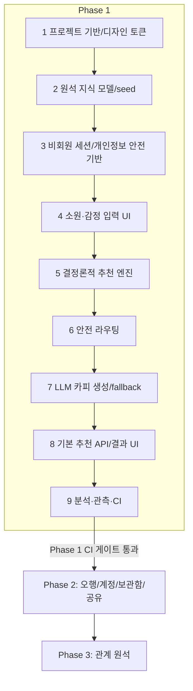

# 11. 구현 로드맵 — 원석 큐레이터

- 문서 버전: 0.1.0
- 최종 수정일: 2026-09-11 (Asia/Seoul)
- 상태: Draft

**중요**: Phase 1의 9단계가 모두 완료되고 [10-testing-and-acceptance.md](10-testing-and-acceptance.md)의 CI 품질 게이트를 통과하기 전에는 Phase 2, Phase 3 구현에 착수하지 않는다. 이는 [00-project-overview.md](00-project-overview.md)와 [AGENTS.md](../AGENTS.md)에서 반복 명시하는 원칙이다.

## Phase 1~3 개발 순서

## 의존성 그래프 (Phase 1 세부)

- 단계 2(원석 모델)는 단계 1(프로젝트 기반)에 의존한다.
- 단계 4(입력 UI)는 단계 1, 2(태그/원석 카탈로그 조회 대상)에 의존한다.
- 단계 5(추천 엔진)는 단계 2(원석/태그 데이터)에 의존하며 단계 4와 병렬 진행 가능하다.
- 단계 6(안전 라우팅)은 단계 3(세션)에 의존하며 단계 4~5와 병렬 진행 가능하다.
- 단계 7(LLM 카피)은 단계 5(확정된 원석)에 의존한다.
- 단계 8(API/결과 UI)은 단계 3, 5, 6, 7 전체 완료를 필요로 한다.
- 단계 9(분석/CI)는 전체 단계에 걸쳐 점진적으로 추가되나, 최종 게이트 확인은 단계 8 이후 수행한다.

## Phase 1 순서

### 1. 프로젝트 기반과 디자인 토큰

- **생성/수정 파일(예정 경로)**: `tailwind.config.ts`, `src/styles/tokens.css`(또는 Tailwind theme extend), `src/app/layout.tsx`(폰트/메타 설정), `tsconfig.json`(strict 확인).
- **입력/출력**: 입력 없음. 출력은 [05-design-system.md](05-design-system.md) 토큰이 Tailwind 설정에 반영된 상태.
- **TDD 순서**: 디자인 토큰은 시각적 산출물이므로 단위 테스트보다 스토리북/시각 회귀(`추가 검증 필요`: 도입 여부)로 검증. 최소한 `tailwind.config.ts`가 타입 오류 없이 컴파일되는지 `pnpm typecheck`로 확인.
- **검증 명령**: `pnpm typecheck`, `pnpm lint`, `pnpm dev` 후 랜딩 페이지 수동 확인.
- **예상 실패 메시지**: 토큰 미정의 시 Tailwind 클래스가 무시되어 스타일 누락(런타임 오류 아님, 시각적 확인 필요).
- **완료 조건**: 320~1440px 전 구간에서 기본 레이아웃이 깨지지 않음.
- **작은 커밋 단위**: "design tokens", "base layout" 분리 커밋 권장.

### 2. 원석 지식 모델과 Seed

- **생성/수정 파일(예정 경로)**: `prisma/schema.prisma`([06-database-schema.md](06-database-schema.md) 반영), `prisma/seed.ts`, `prisma/seed-data/stones.json`, `prisma/seed-data/tags.json`, `prisma/seed-data/stone-tags.json`.
- **입력/출력**: 입력은 전문가 검수된 원석/태그 데이터(`추가 검증 필요`). 출력은 `Stone`, `Tag`, `StoneTag` 시드 완료된 로컬 DB.
- **TDD 순서**: (a) Prisma 스키마 마이그레이션 → (b) 시드 스크립트에 대한 단위 테스트(레코드 수, 필수 필드 존재) → (c) 시드 실행.
- **검증 명령**: `pnpm prisma migrate dev`(예정), `pnpm prisma db seed`(예정), `pnpm test -- seed`.
- **예상 실패 메시지**: 시드 JSON의 `stoneId`/`tagId` 참조 불일치 시 FK 제약 위반 오류(`insert or update on table "StoneTag" violates foreign key constraint`).
- **완료 조건**: 시드된 원석 수 ≥ 최소 목표치(`추가 검증 필요`: 초기 원석 카탈로그 크기), 모든 원석에 fallback 카피([09-ai-prompts-and-safety.md](09-ai-prompts-and-safety.md#fallback-문장-템플릿))가 존재.
- **작은 커밋 단위**: "prisma schema", "seed data", "seed script" 분리.

### 3. 비회원 세션과 개인정보 안전 기반

- **생성/수정 파일(예정 경로)**: `src/lib/session.ts`(세션 토큰 발급/검증), `src/lib/crypto/envelope.ts`(envelope encryption 유틸), `src/lib/crypto/tokenHash.ts`, `src/app/api/v1/sessions/route.ts`.
- **입력/출력**: 입력은 세션 발급 요청. 출력은 [07-api-specification.md](07-api-specification.md#post-sessions) 응답.
- **TDD 순서**: (a) `tokenHash` 유틸 단위 테스트(원문↔해시 왕복 불가능성 검증) → (b) `envelope.ts` 암복호화 왕복 단위 테스트 → (c) `POST /sessions` 통합 테스트(API-01).
- **검증 명령**: `pnpm test -- session`, `pnpm test -- crypto`.
- **예상 실패 메시지**: 해시 비교 로직 미구현 시 토큰 검증이 항상 실패하는 형태로 드러남(`UNAUTHORIZED` 응답 다발).
- **완료 조건**: 세션 토큰 원문이 DB 어디에도 평문으로 저장되지 않음(SEC-03 대응).
- **작은 커밋 단위**: "session token util", "envelope encryption util", "sessions API".

### 4. 소원·감정 입력 UI

- **생성/수정 파일(예정 경로)**: `src/app/wish/page.tsx`(S02), `src/app/heart/page.tsx`(S03), `src/components/wish/WishTagGrid.tsx`, `src/components/heart/OptionalFreeTextArea.tsx`.
- **입력/출력**: 입력은 `GET /catalog/wishes` 응답. 출력은 사용자 선택값(클라이언트 상태).
- **TDD 순서**: (a) 컴포넌트 단위 테스트(RTL) — 단일 선택 강제, 300자 제한 → (b) 접근성 테스트(키보드 탐색) → (c) 페이지 레벨 통합.
- **검증 명령**: `pnpm test -- wish`, `pnpm test -- heart`, `pnpm test:e2e -- --grep "E2E-02"`.
- **예상 실패 메시지**: 라디오 패턴 미구현 시 RTL `getByRole("radio")` 쿼리 실패.
- **완료 조건**: S02, S03 수용 기준([04-screen-specifications.md](04-screen-specifications.md)) 충족.
- **작은 커밋 단위**: 화면별 분리 커밋.

### 5. 결정론적 추천 엔진

- **생성/수정 파일(예정 경로)**: `src/lib/engine/score.ts`, `src/lib/engine/weights.ts`, `src/lib/engine/types.ts`, `src/lib/engine/__tests__/*.test.ts`.
- **입력/출력**: [08-recommendation-engine.md](08-recommendation-engine.md)의 `RecommendationEngineInput` → `RecommendationEngineResult`.
- **TDD 순서**: 테스트를 먼저 작성한다 — ENGINE-01(재정규화) → ENGINE-02(전체 가중치) → ENGINE-03(동점 해결) → ENGINE-04(반복 패널티) → ENGINE-05(오행 친화도) → ENGINE-06(성능) 순으로 구현.
- **검증 명령**: `pnpm test -- engine`.
- **예상 실패 메시지**: 재정규화 미구현 시 "가중치 합이 1.0이 아님" 형태의 속성 기반 테스트 실패.
- **완료 조건**: [08-recommendation-engine.md](08-recommendation-engine.md#결정론-보장)의 결정론 속성 테스트 100% 통과.
- **작은 커밋 단위**: 테스트 파일과 구현 파일을 같은 커밋 또는 "test 먼저, 구현 다음"의 연속된 작은 커밋으로 분리.

### 6. 안전 라우팅

- **생성/수정 파일(예정 경로)**: `src/lib/safety/keywordDetector.ts`, `src/lib/safety/classifyInput.ts`(LLM 호출 래퍼), `src/lib/safety/__tests__/*.test.ts`.
- **입력/출력**: `freeText` 문자열 → `{ isCrisis: boolean, category: string }`.
- **TDD 순서**: (a) 키워드 감지 단위 테스트([09-ai-prompts-and-safety.md](09-ai-prompts-and-safety.md#안전-평가-fixture) fixture 사용) → (b) LLM 분류 모킹 통합 테스트 → (c) 이중 안전망 OR 로직 테스트(둘 중 하나만 참이어도 true) → (d) fail-safe 테스트(분류 실패 시 true로 처리).
- **검증 명령**: `pnpm test -- safety`.
- **예상 실패 메시지**: fail-safe 미구현 시 안전 분류 API 오류 상황에서 `isCrisis=false`로 잘못 처리되는 테스트 실패.
- **완료 조건**: 안전 평가 fixture 전체 통과, E2E-04 통과.
- **작은 커밋 단위**: "keyword detector", "llm safety classifier", "safety routing integration".

### 7. LLM 카피 생성과 Fallback

- **생성/수정 파일(예정 경로)**: `src/lib/llm/provider.ts`(`LLMProvider` 인터페이스), `src/lib/llm/anthropicProvider.ts`(구체 구현, `추가 검증 필요`), `src/lib/llm/prompts/basic.ts`, `src/lib/llm/validator.ts`(출력 후 검증기), `src/lib/llm/fallback.ts`.
- **입력/출력**: 확정된 원석 + 사용자 신호 → `GeneratedRecommendationCopy`.
- **TDD 순서**: (a) 출력 후 검증기 단위 테스트(정상/스키마위반/금지표현/글자수초과) → (b) fallback 전환 로직 테스트 → (c) `LLMProvider` 모킹을 이용한 timeout/retry 테스트.
- **검증 명령**: `pnpm test -- llm`.
- **예상 실패 메시지**: 금지 표현 검증 미구현 시 골든 케이스("반드시 합격합니다" 포함 응답)가 fallback으로 전환되지 않고 그대로 통과하는 테스트 실패.
- **완료 조건**: [09-ai-prompts-and-safety.md](09-ai-prompts-and-safety.md) 프롬프트 회귀 테스트 전체 통과, E2E-03 통과.
- **작은 커밋 단위**: "llm provider interface", "output validator", "fallback templates" 분리.

### 8. 기본 추천 API와 결과 UI

- **생성/수정 파일(예정 경로)**: `src/app/api/v1/recommendations/basic/route.ts`, `src/app/api/v1/recommendations/[id]/route.ts`, `src/app/api/v1/recommendations/[id]/feedback/route.ts`, `src/app/result/new/page.tsx`(S04), `src/app/result/[id]/page.tsx`(S05).
- **입력/출력**: [07-api-specification.md](07-api-specification.md#post-recommendationsbasic) 요청/응답.
- **TDD 순서**: (a) API 통합 테스트(단계 5·6·7 조합) → (b) S04/S05 컴포넌트 테스트 → (c) E2E-01.
- **검증 명령**: `pnpm test -- recommendations`, `pnpm test:e2e -- --grep "E2E-01"`.
- **예상 실패 메시지**: 소유권 검증 누락 시 다른 세션의 `recommendationId`로 접근 가능한 보안 테스트(SEC-05) 실패.
- **완료 조건**: E2E-01, E2E-03 통과, FR-BASIC-001~013 수용 기준 충족.
- **작은 커밋 단위**: API 라우트별, 화면별 분리.

### 9. 분석·관측·CI

- **생성/수정 파일(예정 경로)**: `src/lib/analytics/track.ts`(allowlist 기반 이벤트 전송), `.github/workflows/ci.yml`(`추가 검증 필요`: CI 플랫폼 확정), `src/lib/analytics/__tests__/allowlist.test.ts`.
- **입력/출력**: 분석 이벤트 → allowlist 검증 통과 후 전송.
- **TDD 순서**: (a) allowlist 필드 화이트리스트 단위 테스트 → (b) 개인정보 비노출 테스트 → (c) CI 파이프라인에 전체 게이트 연결.
- **검증 명령**: `pnpm test`, `pnpm test:e2e`, `pnpm typecheck`, `pnpm lint`.
- **예상 실패 메시지**: allowlist 외 필드 포함 시 "unexpected key in analytics payload" 형태의 테스트 실패.
- **완료 조건**: [10-testing-and-acceptance.md](10-testing-and-acceptance.md#ci-품질-게이트) 전체 통과 — 이 시점이 Phase 1 완료 기준선이다.
- **작은 커밋 단위**: "analytics allowlist", "ci pipeline".

## Phase 2 개요 (착수는 Phase 1 완료 후)

오행 분석(FiveElementProfile 계산 로직, 양력/음력 변환), 계정/로그인, 보관함(S14), 공유 링크(S13), 개인정보 동의·철회·삭제 흐름.

**실제 구현 범위 (2026-09-12 기준)**: 오행 분석(S06~S08, FR-FIVE-001~004)과 공유 링크(S13, FR-FIVE-007)를 비회원 세션 기반으로 구현했다. 사용자 확인에 따라 계정/로그인(FR-FIVE-005)과 보관함(FR-FIVE-006, S14)은 보류했다 — 인증 방식이 미확정이고, 비회원 세션만으로도 오행·공유 가치를 먼저 검증할 수 있다는 판단([13-decisions-and-open-questions.md](13-decisions-and-open-questions.md) 참조). 개인정보 동의 기록(`ConsentRecord`)은 오행 분석 제출 시점에 함께 생성되지만, 철회·삭제 UI(FR-FIVE-008의 S14 부분)는 계정 기능과 함께 후속 구현이 필요하다. 상세는 [실제 구현 참고 (Phase 2 오행분석 공유)](#실제-구현-참고-phase-2-오행분석-공유)를 참조한다.

## Phase 3 개요 (착수는 Phase 2 완료 후)

관계 유형/목표 선택(S09~S11), 관계 원석 산출(S12), 초대 링크, 양방향 결과. 커머스/수호 캐릭터 확장은 [13-decisions-and-open-questions.md](13-decisions-and-open-questions.md)의 미해결 질문으로 별도 관리하며 본 로드맵에 포함하지 않는다.

## Rollback 전략

- 각 단계는 독립적으로 revert 가능한 작은 커밋 단위로 구성한다(위 "작은 커밋 단위" 참조).
- DB 마이그레이션은 Prisma의 `migrate dev`/`migrate deploy` 이력을 통해 역방향 마이그레이션 스크립트를 함께 준비한다(`추가 검증 필요`: 실제 운영 환경 rollback 절차).
- LLM 프롬프트 변경은 `promptVersion`을 올리는 방식으로 배포하며, 문제 발생 시 이전 `promptVersion`으로 즉시 되돌릴 수 있도록 프롬프트 정의를 버전별로 보관한다.
- 추천 엔진 가중치 변경은 `rulesetVersion`을 올리는 방식으로 배포하며 과거 결과는 소급 변경하지 않으므로 롤백 시에도 데이터 정합성 문제가 없다.

## 배포 체크리스트

Phase 1 최초 배포 전 확인 항목(`추가 검증 필요`: 실제 배포 인프라 확정 후 구체화).

- [ ] 환경변수(`README.md`의 환경 변수 이름 목록) 배포 환경에 설정 완료
- [ ] DB 마이그레이션 적용 완료(`prisma migrate deploy`)
- [ ] 원석/태그 시드 데이터 적재 완료
- [ ] CI 품질 게이트 전체 통과 확인
- [ ] rate limit 설정 활성화 확인
- [ ] TLS 인증서 및 도메인 연결 확인
- [ ] 분석 이벤트 allowlist 검증 통과 확인
- [ ] fallback 카피가 전체 원석에 대해 존재함을 확인

## 실제 구현 참고 (Phase 1 착수 후 확정된 사항)

Phase 1 MVP를 실제로 구현하며 위 계획과 달라지거나 구체화된 부분을 기록한다.

- **Tailwind v4**: `tailwind.config.ts`가 아니라 `src/app/globals.css`의 `@theme`/`@theme inline` CSS 블록으로 디자인 토큰을 정의한다(설치된 `tailwindcss@4` 실제 동작 확인).
- **Prisma 7 breaking change**: `schema.prisma`의 `datasource.url`이 더 이상 지원되지 않는다. 대신 루트의 `prisma.config.ts`(`defineConfig` + `env()`)에 연결 정보를 두고, 런타임 `PrismaClient`는 `@prisma/adapter-pg`(`pg` 패키지 기반) 드라이버 어댑터를 명시적으로 주입해야 한다(`src/lib/db.ts`). `prisma migrate`/`db seed` 명령도 `prisma.config.ts`의 `migrations.seed`(`tsx prisma/seed.ts`)를 통해 동작한다.
- **Next.js 16 동적 라우트**: Route Handler와 Page 컴포넌트의 `params`는 `Promise<{...}>`이며 `await`가 필요하다(v15부터의 변경).
- **`envelope.ts` 보류**: Phase 1 데이터 모델(`AnonymousSession`/`Stone`/`Tag`/`StoneTag`/`WishSession`/`Recommendation`/`Feedback`)에는 암호화 대상 필드가 없어(생년월일시·상대방 별명은 Phase 2/3) 구현하지 않았다. `src/lib/crypto/tokenHash.ts`(세션 토큰 해시)만 존재한다.
- **OpenAI 추론 모델 튜닝**: `gpt-5-nano` 등 추론 모델은 `reasoning_effort`를 지정하지 않으면 hidden reasoning 토큰이 `max_completion_tokens` 예산을 모두 소진해 `content`가 빈 문자열로 반환될 수 있다(`finish_reason: "length"`). `OPENAI_REASONING_EFFORT` 환경변수(권장값 `minimal`)로 대응했다(`src/lib/llm/openaiProvider.ts`).
- **Vitest 기본 환경은 `node`** (jsdom 아님): Phase 1 테스트가 전부 서버 로직(API 라우트, 엔진, 안전, LLM)이었는데, jsdom 환경에서는 실제 네트워크 fetch(OpenAI 호출 등)가 조용히 실패해 안전장치의 fail-safe 경로로 빠지는 문제를 발견했다. 향후 React 컴포넌트 테스트를 추가할 때는 해당 테스트 파일에 `// @vitest-environment jsdom`을 명시한다.
- **패키지 매니저**: `docs/13`의 미해결 항목을 npm 유지로 확정했다(저장소의 기존 `package-lock.json`을 그대로 사용).
- **E2E-03(LLM 실패 시 fallback)**: 별도 Playwright 서버 대신 `FORCE_LLM_FALLBACK_FOR_TESTS=1`(프로덕션에서는 비활성화)로 실제 fallback 경로를 결정론적으로 재현하는 Vitest 통합 테스트로 구현했다(`route.fallback.test.ts`). Next.js dev 서버가 프로젝트 디렉터리당 단일 인스턴스 잠금(`.next/dev/lock`)을 가져 동일 저장소에서 두 번째 `next dev`를 별 포트로 띄우기 어려웠기 때문이다. E2E-01/02/04/09는 Playwright로 구현했다(`e2e/*.spec.ts`, `playwright.config.ts`는 `NEXT_DIST_DIR`로 별도 `.next-e2e` 빌드 디렉터리를 사용해 기존 dev 서버와 충돌하지 않는다).
- **로컬 PostgreSQL**: 이 머신에는 Docker가 없어 Homebrew로 PostgreSQL 16을 직접 설치했다(`gemstonecurator_dev`, `gemstonecurator_test` 두 개 DB).

## 실제 구현 참고 (Phase 2 오행분석 공유)

- **오행 계산 라이브러리**: `lunar-javascript`(중국 농력/사주팔자 라이브러리)를 사용해 양력↔음력 변환과 사주팔자(년/월/일/시주)·오행 추출을 구현했다(`src/lib/fiveElements/calculate.ts`). 절기 기준 월주 계산은 라이브러리에 위임한다. 용신(부족한 기운) 판단은 "사주팔자 8자(시주 미상 시 6자) 중 최소 빈도 원소"라는 단순 휴리스틱이며, 명리학 정식 용신 판단(강약/조후 등)은 구현하지 않았다 — `docs/13` 미해결 항목.
- **윤달 처리**: S07에 원안에 없던 "윤달이에요" 체크박스를 추가했다(음력 선택 시에만 노출). `lunar-javascript`는 월에 음수를 넣는 방식(`Lunar.fromYmd(y, -m, d)`)으로 윤달을 표현하며, `calculateFiveElements`가 이를 내부적으로 처리한다.
- **Prisma 7 `migrate dev`의 비대화형 제약**: 컬럼 추가에 경고(예: nullable unique 제약)가 있으면 `prisma migrate dev`가 비대화형 셸에서 실패한다(`Error: ... non-interactive`). `prisma migrate diff --script -o <file>`로 SQL을 파일로 직접 생성(스크립트 stdout을 그대로 `tee`하면 dotenv 배너 문자열이 SQL 파일 맨 위에 섞여 문법 오류가 나므로 반드시 `-o` 옵션 사용)한 뒤, 마이그레이션 폴더에 수동 배치하고 `prisma migrate deploy`로 적용했다. `migrate diff --from-migrations`는 `prisma.config.ts`에 `datasource.shadowDatabaseUrl`(별도 `gemstonecurator_shadow` DB) 설정이 필요하다.
- **Buffer vs Uint8Array 타입 불일치**: Prisma 7이 생성한 `Bytes` 필드 타입이 `Uint8Array<ArrayBuffer>`로 엄격화되어 있어 Node `Buffer`(내부적으로 `ArrayBufferLike`)를 직접 대입할 수 없다. `new Uint8Array(length)` + `.set()`으로 명시적 `ArrayBuffer` 기반 `Uint8Array`를 만들어 해결했다(`src/lib/crypto/envelope.ts`).
- **envelope encryption**: `ENCRYPTION_KEK`(base64 32바이트) 환경변수 기반 AES-256-GCM으로 `birthDateEncrypted`/`birthTimeEncrypted`를 암호화한다. 실제 KMS 연동은 하지 않았다(`docs/13` 추가 검증 필요, 프로덕션 배포 전 필수 전환 항목).
- **공유 링크 공개 조회(`GET /shares/{token}`)는 세션 불필요**: 클라이언트에서 `apiFetch`(세션 자동 발급)가 아닌 일반 `fetch`를 사용해, 공유 링크를 받은 제3자가 불필요하게 세션을 발급받지 않도록 했다.

## 실제 구현 참고 (Phase 2 삭제 경로)

Phase 2 완료 직후 "비회원 세션의 민감정보 삭제 경로 부재" 위험(docs/13)을 사용자 요청으로 우선 처리하며 추가한 것들이다.

- **FK 삭제 순서 제약 발견**: `FiveElementProfile.consentRecordId`는 `ON DELETE RESTRICT`, `Recommendation.fiveElementProfileId`는 `ON DELETE SET NULL`로 마이그레이션됐다(Prisma가 필수/선택 관계에 따라 자동 추론). 이 때문에 `AnonymousSession`을 먼저 지우면 cascade가 `ConsentRecord`를 지우려다 여전히 그것을 참조하는 `FiveElementProfile`에 막혀 실패한다. `src/lib/dataDeletion.ts`는 `FiveElementProfile`을 먼저 삭제한 뒤 `AnonymousSession`을 삭제하는 순서를 트랜잭션으로 강제해 이 문제를 해결했다 — 실제 DB로 검증한 통합 테스트(`dataDeletion.test.ts`)가 없었다면 이 순서 문제를 놓치기 쉬웠다.
- **삭제 함수는 멱등하게 구현**: `AnonymousSession` 삭제에 `delete()` 대신 `deleteMany()`를 사용해, 이미 삭제된 세션 id로 다시 호출해도 예외를 던지지 않는다. `resolveSession`의 즉시 정리와 `cleanupExpiredSessions` 배치가 같은 세션을 동시에 처리할 수 있어(예: 병렬 테스트 실행 중 실제로 경합이 발생해 한 번 테스트가 실패했다) 필요한 안전장치였다.
- **API 경로**: 계정이 없어 `DELETE /me/data`(회원 전용) 대신 `DELETE /api/v1/sessions/current`를 추가했다. 대상은 URL 파라미터가 아니라 `Authorization` 헤더의 세션 토큰 자체로 특정한다.
- **최소 UI**: 이 시점에는 S14가 아직 없어 원래 화면 인벤토리에 없던 `/privacy` 페이지를 새로 추가해 랜딩(S01) 푸터에서 연결했다(이후 S14 구현 시 `/privacy`는 S14의 하위 화면으로 편입됨, 아래 참조). 확인 단계(취소 가능)를 거친 뒤 삭제하며, 삭제 후 저장된 세션 토큰을 지워 다음 방문 시 새 세션을 발급받는다.
- **배치 정리 스크립트**: `npm run cleanup:sessions`(`scripts/cleanupExpiredSessions.ts`)가 만료된 모든 `AnonymousSession`을 찾아 동일한 삭제 로직을 반복 호출한다. 실제 운영에서 이 스크립트를 언제·어떻게 실행할지(cron, Vercel Cron 등)는 배포 인프라 확정 후 결정해야 한다(docs/13 추가 검증 필요).

## 실제 구현 참고 (Phase 2 보관함, 계정 없이 구현)

사용자가 계정/로그인(FR-FIVE-005)을 만들지 않기로 결정하면서(docs/13), 원안의 "회원 전용 S14"를 로그인 없는 버전으로 다시 설계해 구현했다.

- **세션 토큰 저장소를 `sessionStorage`에서 `localStorage`로 전환**: `sessionStorage`는 탭을 닫으면 사라져 "보관함"이 의미가 없어진다. `localStorage`는 브라우저를 껐다 켜도 유지되므로(서버 만료는 기존 30일 그대로) 계정 없이도 "같은 기기에서 과거 결과 다시 보기"가 가능해졌다(`src/lib/client/session.ts`). 트레이드오프는 docs/13의 ADR 8 후보에 기록했다.
- **`apiFetch`에 401 재시도 추가**: 저장된 토큰이 서버에서 이미 삭제·만료된 상태로 남아있을 수 있어(예: 다른 탭에서 `/privacy`로 삭제한 경우), 401을 받으면 저장된 토큰을 지우고 새 세션을 발급받아 한 번 재시도한다.
- **`GET /me/recommendations`(원안) 대신 `GET /recommendations` 구현**: "회원(me)" 개념이 없어 이름을 바꾸고, 인증은 세션 토큰만으로 충분하다. 응답 스키마는 원안에서 `relationshipCount`(Phase 3 미구현)만 제외하고 동일하게 유지했다.
- **S14(`/library`) 구현**: 원안대로 "보관함"/"개인정보 설정" 두 탭 구조를 유지하되, 개인정보 설정 탭은 별도 UI를 새로 만들지 않고 기존 `/privacy` 페이지로 링크만 연결했다(중복 구현 회피). 결과 화면(S05, S08)에는 "이 결과는 보관함에서 다시 볼 수 있어요" 링크를 추가해 별도의 "저장" 동작 없이도(계정이 없으므로 애초에 모든 결과가 세션에 자동으로 남는다) 보관함의 존재를 알린다.

## 실제 구현 참고 (Phase 3 관계 원석)

사용자가 "빨리 개발할 수 있도록 최대한 간단하게 구현"을 명시적으로 요청해, 원안(S09~S12, 비동기 초대 링크 흐름)을 아래와 같이 단순화했다(자세한 결정 근거는 [13-decisions-and-open-questions.md](13-decisions-and-open-questions.md#확정된-제품-결정) 참조).

- **기본 흐름은 동기, 초대 링크는 나중에 별도로 추가**: `POST /recommendations/{id}/relationship` 한 번의 호출에서 요청자가 상대방의 닉네임과(선택) 생년월일시까지 함께 제출하는 동기 흐름을 먼저 만들었다. 이후 사용자가 초대 링크 기능(FR-REL-005/006)을 요청해, 파트너 정보 없이 생성된 결과에 한해 `POST /recommendations/{id}/relationship/{relationshipAnalysisId}/invite`(토큰 발급) → `GET /relationship-invites/{token}`(미리보기, 인증 불필요) → `POST /relationship-invites/{token}/respond`(상대방이 자신의 생년월일시 제출)의 3개 엔드포인트로 추가했다. 원안의 `status: RelationshipStatus` 컬럼은 저장하지 않고 `partnerStoneId` 유무로 매 응답마다 계산한다(이중 관리 방지, [13-decisions-and-open-questions.md](13-decisions-and-open-questions.md#확정된-제품-결정) 참조). 상대방이 제출한 생년월일시의 `ConsentRecord`는 상대방 세션이 없으므로 요청자의 `anonymousSessionId`에 귀속시켜, 기존 세션 삭제 cascade 경로를 그대로 재사용한다.
- **소유자 화면이 완성된 초대 결과를 다시 볼 수 있도록 `GET /recommendations/{id}`에 `relationships` 배열을 추가**했다(원안 API 스펙에 이미 `"relationships": []` 자리표시가 있었다). `RelationshipView`는 마운트 시 이 배열의 최신 항목을 조회해 있으면 바로 결과 단계로, 없으면 인트로 단계로 진입한다 — 그래야 초대를 보낸 뒤 페이지를 벗어났다가 돌아와도 상대방이 응답한 최신 상태(상대의 원석 포함)를 볼 수 있다.
- **UI는 4개 화면(S09~S12) 대신 컴포넌트 하나(`RelationshipView`, `src/components/relationship/RelationshipView.tsx`)의 내부 스텝 전환(`intro→form→loading→result`)으로 구현**했다. 라우트는 `/result/[id]/relationship` 하나뿐이다.
- **관계 유형(`relationshipType`)을 원석 점수화 신호에서 제외**: [08-recommendation-engine.md](08-recommendation-engine.md) 원안은 `relationshipType`에 0.10 가중치를 배정했으나, 원석↔관계유형 친화도를 뒷받침할 근거(전문가 검수 전)가 없어 제외하고 나머지 신호에 비례 배분했다. `relationshipType`은 여전히 LLM 대화 제안 카피의 맥락 입력으로는 쓰인다(`src/lib/llm/prompts/relationship.ts`).
- **`partner-five-elements`라는 4번째 엔진 컨텍스트를 새로 추가**했다(`src/lib/engine/weights.ts`). 상대방은 본인 소원/감정을 입력하지 않으므로 오행 보완 가중치만 1.0으로 상대방의 원석을 정한다.
- **상대방 오행 프로필은 LLM 카피를 생성하지 않는다**: `FiveElementProfile`의 `heartSummary`/`rationale`/`comfortLines`/`microAction` 등 카피 필드를 Phase 3에서 모두 nullable로 바꾸고, 상대방 프로필에는 `null`로 남겨 불필요한 LLM 호출을 피했다. 본인 오행(S08) 결과에서만 이 필드들이 채워진다.
- **공유(`ShareLink`)는 `scope: "relationship"` + `relationshipAnalysisId`(nullable, `ON DELETE CASCADE`) 컬럼만 추가**해 기존 문자열 `scope` 컬럼 방식을 그대로 확장했다(다형성 CHECK 제약 도입은 하지 않음, Phase 2와 동일한 방식 유지).
- **`catalog/wishes`에 `relationshipGoals`를 추가**해 새 엔드포인트를 만들지 않고 재사용했다(`RELATIONSHIP_GOAL` 태그 5종).
- **검증**: 통합 테스트 12개 신규 추가(관계 원석 생성 5개, 공유 링크 2개), Playwright E2E 1개(`e2e/relationship-flow.spec.ts`) 추가. E2E 작성 중 `getByText("우리의 원석")`이 로딩 문구("우리의 원석을 찾고 있어요...")의 부분 문자열과 겹쳐 병렬 실행 시 간헐적으로 오탐 성공하는 문제를 발견해, 결과 전용 문구("대화를 시작해보세요")로 단언을 교체했다 — Playwright의 `getByText`는 기본이 부분 일치라는 점을 재확인.
- **초대 링크 검증(이후 제거됨)**: 통합 테스트 4개(`invite/route.test.ts`, 정상 완성/재사용 차단/소유자 아님/존재하지 않는 토큰) + Playwright E2E 1개(`e2e/relationship-invite-flow.spec.ts`, 별도 브라우저 컨텍스트로 소유자↔상대방 양쪽을 모두 조작)를 추가했다. `npx playwright test` 전체 실행(4-worker 병렬) 중 이 테스트가 실제 OpenAI 호출 경합으로 60초 타임아웃 1회 발생 → 재실행 시 21/21 전체 통과로 일회성임을 확인(Phase 2에서도 관측된 동일 패턴, 코드 회귀 아님). **아래 "실제 구현 참고 (상대방 출생정보 필수화)" 절에서 설명하듯 이 초대 흐름 전체가 이후 제거되어, 위 테스트와 라우트도 함께 삭제됐다.**

## 실제 구현 참고 (상대방 출생정보 필수화)

사용자가 관계 원석 결과에서 "나는 자수정, 상대방은 오팔(오행 화면) vs 나는 아마조나이트, 상대방은 로즈쿼츠(관계 화면)"처럼 같은 사람의 원석이 화면마다 다르게 나오는 것을 발견해 문제를 제기했다. 원인은 두 가지였다: (1) 관계 화면의 "나의 원석"이 오행 통합 결과(`fiveElementProfile.integratedStoneId`)가 아니라 기본 추천(`recommendation.stoneId`)을 그대로 쓰고 있었고, (2) "우리의 원석"이 나의 오행만 반영하고 상대방의 오행은 전혀 반영하지 않았다(상대방 출생정보가 애초에 선택 입력이라 없을 수도 있었기 때문). 이를 바로잡는 과정에서 사용자가 "관계 원석을 받으려면 나와 상대방의 생년월일을 둘 다 받은 뒤에 추천하라"고 범위를 명확히 해, 아래와 같이 재설계했다(자세한 결정 근거는 [13-decisions-and-open-questions.md](13-decisions-and-open-questions.md#확정된-제품-결정) 참조).

- **"나의 원석" 버그 수정**: `relationship/route.ts`가 `recommendation.fiveElementProfile?.integratedStoneId`를 우선 사용하도록 변경(없으면 이번 요청에서 새로 계산).
- **"우리의 원석"이 두 사람의 오행을 모두 반영하도록 엔진 확장**: `FiveElementSignal`에 `partnerNeededElement`를 추가하고, 둘 다 있으면 `combinedElementAffinity()`(각자의 필요 기운에 대한 오행 친화도 평균)를 사용하도록 `score.ts`를 확장했다([08-recommendation-engine.md](08-recommendation-engine.md) 참조).
- **상대방 생년월일시를 선택 → 필수로 변경**: 상대방의 오행 없이는 "우리의 원석"이 상대방을 전혀 반영하지 못해 결과가 일관성 없어 보이는 근본 원인이었으므로, `partnerBirthInfo`를 `RelationshipRequestSchema`의 필수 필드로 바꿨다. 이미 오행 분석(S06~S08)을 마친 사용자는 `myBirthInfo`를 생략할 수 있고(기존 프로필 재사용), 그렇지 않으면 `myBirthInfo`도 이번 요청에 함께 제출해야 한다 — 공용 헬퍼 `createFiveElementProfileForRecommendation()`(`src/lib/fiveElements/createProfile.ts`)으로 오행 계산·LLM 카피 생성·저장 로직을 `five-elements/route.ts`와 `relationship/route.ts`가 공유하도록 추출했다.
- **초대 링크 기능(FR-REL-005/006) 전체 제거**: 상대방 출생정보가 필수가 되면서 "파트너 정보 없이 결과를 만들고 나중에 초대 링크로 채운다"는 흐름 자체가 도달 불가능해졌다. 관련 라우트(`.../relationship/[relationshipAnalysisId]/invite`, `/relationship-invites/[token]` 전체), 컴포넌트(`InviteButton`, `RelationshipInviteView`), 테스트(`e2e/relationship-invite-flow.spec.ts` 포함)를 모두 삭제하고, `inviteTokenHash`/`inviteExpiresAt` 컬럼을 제거하는 마이그레이션(`20260913232442_drop_relationship_invite`)을 적용했다.
- **UI(`RelationshipView`)**: 상대방 정보 입력 폼에 항상 "상대방의 생년월일시" 섹션을 노출하고, 오행 분석 미완료 사용자에게는 "나의 생년월일시" 섹션도 추가로 노출한다(공용 `BirthDateFields` 컴포넌트로 두 섹션의 UI를 재사용). 결과 화면의 "나: X / 상대: Y" 칩도 이제 항상 표시된다(이전에는 상대 정보가 없을 수 있어 조건부였다).
- **검증**: 관계 라우트 통합 테스트를 7개로 재작성(둘 다 필수/오행 재사용/누락 시 400 등), 엔진 테스트 1개 추가(`combinedElementAffinity` 가중 평균 검증), `e2e/relationship-flow.spec.ts`를 새 필수 입력 흐름에 맞게 재작성. `npx tsc --noEmit`/`npx eslint src`/`npx vitest run`(전체 스위트)/`npx playwright test`(전체 20개) 모두 통과 확인.

## Assumptions

- 각 단계의 "예정 경로"는 Next.js App Router 관례를 따른 제안이며 실제 구현 시 조정될 수 있다.
- CI 플랫폼(GitHub Actions 등)은 미정이며 `.github/workflows/ci.yml`은 예시 경로다.

## 추가 검증 필요

- Phase 2/3 세부 작업 분해(Phase 1 완료 후 갱신)
- CI 플랫폼 확정
- 실제 배포 인프라 및 배포 체크리스트 구체화
- 초기 원석 카탈로그 최소 크기
