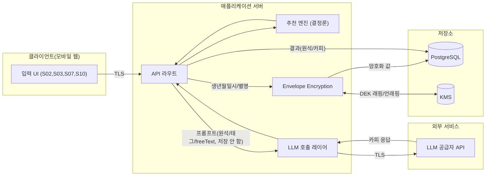

# 12. 개인정보·보안·컴플라이언스 — 원석 큐레이터

- 문서 버전: 0.1.0
- 최종 수정일: 2026-09-11 (Asia/Seoul)
- 상태: Draft

본 문서는 설계 의도를 기술하며, 법률 준수 여부를 확정적으로 단정하지 않는다. `추가 검증 필요`로 표시된 항목은 법무/개인정보보호 전문가 검토가 필요하다.

## 데이터 흐름도

## 데이터 분류

| 분류 | 예시 | 저장 방식 |
|---|---|---|
| 민감 개인정보 | 생년월일시, 상대방 별명 | envelope encryption, DB 저장, 로그 금지 |
| 일시 처리 개인정보 | 자유 입력(`freeText`) | DB 미저장, LLM 요청 처리 후 즉시 폐기, 로그 금지 |
| 인증 정보 | 세션/공유/초대 토큰 | 해시만 저장, 원문 1회성 응답 |
| 계정 정보 | 이메일, 비밀번호 해시 | 표준 해시(bcrypt/argon2 등, `추가 검증 필요`), DB 저장 |
| 비민감 파생 데이터 | 추천 원석, 오행 분포(`balanceJson`), AI 생성 카피 | 평문 DB 저장 가능 |
| 분석 이벤트 | 화면 조회, 클릭 등 | [분석 이벤트 allowlist](#분석-이벤트-allowlist) 필드만 저장 |

## 개인정보 수집 목적

| 항목 | 목적 | 근거 화면 |
|---|---|---|
| 생년월일시 | 오행 분석 계산 | S07 |
| 상대방 별명 | 관계 원석 결과 생성(호칭 용도) | S10 |
| 상대방 출생정보(선택) | 관계 원석 심화 계산 | S10 |
| 이메일 | 계정 식별, 결과 보관 | S14(가입) |
| 자유 입력 | 위로 카피 개인화(일시적) | S03 |
| 만족도/코멘트 | 서비스 품질 개선 | S05 |

수집 항목은 서비스 제공에 필요한 최소 범위로 한정하며, 마케팅 목적의 추가 수집은 하지 않는다(Phase 1~3 범위 내).

## 보유·파기 정책

[06-database-schema.md](06-database-schema.md#데이터-보유기간)의 표를 기준 문서로 삼는다. 핵심 원칙:

- 민감 필드(생년월일시, 상대방 별명)는 동의 철회 또는 계정 삭제 시 즉시(비동기 배치라도 24시간 이내, `추가 검증 필요`) 파기한다.
- 비회원 세션은 일정 기간(현재 구현값 30일, `docs/06` 데이터 보유기간 참조) 미사용 시 자동 만료·파기한다. 실제 구현은 두 겹으로 되어 있다: (1) 만료된 세션 토큰이 `resolveSession` 호출 중 우연히 다시 사용되면 즉시 정리하고(`src/lib/session.ts`), (2) 방치된(재방문하지 않는) 만료 세션은 `npm run cleanup:sessions`(`scripts/cleanupExpiredSessions.ts`)로 일괄 정리한다. 이 스크립트를 실제 운영 스케줄러(cron 등)에 연결하는 것은 `추가 검증 필요`(배포 인프라 확정 후).
- 계정 기능이 없는 현재는 사용자가 `DELETE /sessions/current`(`/privacy` 화면)를 통해 자신의 비회원 세션 데이터를 언제든 직접 삭제할 수 있다([07-api-specification.md](07-api-specification.md#delete-sessionscurrent) 참조). 이는 계정 없이도 삭제권을 보장하기 위한 조치다.
- 법정 보유 의무가 있는 항목(예: 전자상거래 관련 기록, 해당 시)은 별도 보관하되 접근을 제한한다(`추가 검증 필요`: Phase 1~3에서는 해당 사항 없음으로 가정, 커머스 확장 시 재검토).

## 동의 버전 관리

- `ConsentRecord.consentVersion`에 개인정보처리방침/이용약관의 게시 버전(예: `privacy-policy-2026-09-11`)을 기록한다.
- 방침 개정 시 기존 동의는 무효화하지 않되, 신규 기능 이용 시 최신 버전 동의를 재요청한다(`추가 검증 필요`: 재동의 트리거 정책).
- 동의 이력은 철회 후에도 감사 목적상 `revokedAt`과 함께 보존하다가 보유기간 종료 시 삭제한다.

## 상대방 정보 처리 정책

- 관계 기능은 사용자 본인이 아닌 제3자(상대방)의 정보를 처리하므로, 실명이 아닌 **별명**만 필수로 수집하고 출생정보는 선택으로 최소화한다.
- 상대방 본인의 직접 동의를 받기 어려운 구조이므로, 상대방 식별 가능 정보(실명, 연락처 등)는 애초에 입력 필드로 제공하지 않는다(S10 설계 원칙).
- 상대방이 초대 링크를 통해 직접 참여하는 경우(FR-REL-006, Phase 3), 상대방 본인이 자신의 정보를 직접 입력하고 동의하는 흐름으로 설계해야 한다(`추가 검증 필요`: 상세 설계).
- 상대방 정보를 제3자(사용자 본인이 아닌 관계 대상)의 개인정보로 볼 경우의 법적 처리 근거는 `추가 검증 필요`(개인정보보호법상 제3자 정보 처리 이슈).

## 암호화 정책

- 전송 구간: 전체 TLS 적용(NFR-SEC-001).
- 저장 구간: 생년월일시, 상대방 별명은 application-level envelope encryption(DEK를 KMS 관리 KEK로 래핑) 적용([06-database-schema.md](06-database-schema.md#암호화-필드)).
- 토큰류(세션/공유/초대): 단방향 해시(SHA-256 이상) 저장.
- 비밀번호(계정 인증 방식 확정 시): 표준 느린 해시 알고리즘(bcrypt/argon2, `추가 검증 필요`) 적용.

## Secret 관리

- 실제 API 키, DB 자격증명, KMS 키 등은 본 문서를 포함한 어떤 저장소 파일에도 평문으로 기록하지 않는다.
- 환경변수를 통해 주입하며, 이름 목록은 [README.md](../README.md#환경-변수-이름)에 정의한다(값은 포함하지 않음).
- 로컬 개발 시 `.env.local`(gitignore 처리) 사용, 프로덕션은 별도 secret manager 사용(`추가 검증 필요`: 구체 서비스 선정).

## 로그 Redaction

다음 필드는 애플리케이션/서버/에러 로그 어디에도 원문으로 기록하지 않는다: 생년월일시, 자유 입력, 상대방 별명, 세션/공유/초대 토큰 원문, 비밀번호, 이메일 전체(부분 마스킹 예외는 `추가 검증 필요`). 오류 로그에 요청 본문을 포함해야 하는 경우 위 필드는 `"[REDACTED]"`로 치환한다.

## 분석 이벤트 Allowlist

분석 이벤트는 다음 필드만 포함할 수 있다: 이벤트명, 익명화된 세션/사용자 참조(직접 식별자 아닌 내부 UUID), 화면 ID, 태그 ID(레이블 텍스트 아님, `추가 검증 필요`: 레이블까지 허용할지), boolean 플래그(예: `freeTextProvided`), 타임스탬프, `rulesetVersion`/`promptVersion`/`usedFallback` 등 관측 메타데이터. 아래는 **금지**된다: 생년월일시, 자유 입력 원문, 상대방 별명, 이메일, IP 원문, 피드백 코멘트 원문.

[03-user-flows.md](03-user-flows.md)에 나열된 이벤트명들이 이 allowlist 구조를 따른다.

## 공유 링크 보안

- 토큰은 암호학적으로 안전한 난수로 생성하고 해시만 저장([06-database-schema.md](06-database-schema.md#공유-토큰-해시-정책)).
- 공유 payload는 개인정보가 제거된 요약본만 노출(FR-FIVE-007, S13).
- 만료된/철회된 토큰은 `410`으로 응답하고, 존재하지 않는 토큰은 `404`로 응답해 토큰 추측 공격 시 유효 토큰 존재 여부를 구분하기 어렵게 한다(`추가 검증 필요`: 완전한 타이밍 공격 방어 여부).
- 조회 시 rate limiting 적용(SEC-04).

## CSRF, XSS, SQL Injection, SSRF 방어

- **CSRF**: 상태 변경 API(`POST`/`DELETE`)는 `Authorization` 헤더 기반 인증을 사용하며 쿠키 기반 세션을 사용하지 않는 것으로 가정, CSRF 토큰 별도 요구는 `추가 검증 필요`(쿠키 사용 시 SameSite 정책 및 CSRF 토큰 필요).
- **XSS**: 사용자 입력(자유 입력, 별명 등)은 렌더링 시 React의 기본 이스케이프를 사용하고 `dangerouslySetInnerHTML`을 사용하지 않는다. LLM 생성 텍스트도 동일하게 일반 텍스트로만 렌더링한다.
- **SQL Injection**: Prisma ORM의 파라미터화된 쿼리만 사용하고 원시 SQL(`$queryRawUnsafe` 등)은 사용하지 않는다.
- **SSRF**: 서버가 사용자 제공 URL로 아웃바운드 요청을 하는 기능이 없으므로 해당 공격면은 최소화된다(`추가 검증 필요`: 향후 OG 이미지 생성 등에서 외부 URL을 다룰 경우 재검토).

## Rate Limiting

각 엔드포인트의 구체 임계값은 [07-api-specification.md](07-api-specification.md)에 명시했다(다수 `추가 검증 필요` 표시). 공통 원칙: 세션/사용자 단위와 IP 단위 이중 제한, 초과 시 `429 RATE_LIMITED` 일관된 오류 envelope 반환.

## 공급망 보안

- 의존성은 lockfile(`추가 검증 필요`: npm vs pnpm, [13-decisions-and-open-questions.md](13-decisions-and-open-questions.md) 참조)로 고정한다.
- 신규 의존성 추가 시 유지보수 활성도, 라이선스, 알려진 취약점 여부를 검토한다(`추가 검증 필요`: 검토 프로세스 공식화).

## Dependency Audit

- CI 파이프라인에 `pnpm audit`(또는 동등 도구) 실행을 포함한다(`추가 검증 필요`: CI 확정 후 구성).
- Critical/High 취약점 발견 시 병합을 차단하는 정책을 권장한다.

## SBOM

- Phase 1 배포 전 SBOM(Software Bill of Materials) 생성 도구 도입 여부는 `추가 검증 필요`.

## 백업·복구

- PostgreSQL 정기 백업 주기 및 보관 기간은 `추가 검증 필요`(인프라 확정 후).
- 암호화 필드의 DEK/KEK 백업·키 순환(rotation) 절차는 `추가 검증 필요`.
- 복구 훈련(DR drill) 주기는 `추가 검증 필요`.

## 침해 대응 초안

1. 탐지: 비정상 API 호출 패턴, rate limit 대량 초과, DB 비정상 접근 알림(`추가 검증 필요`: 모니터링 도구 선정).
2. 격리: 영향받은 자격증명/토큰 즉시 폐기(세션 전체 무효화 절차 `추가 검증 필요`).
3. 통지: 개인정보보호법상 통지 의무 대상 및 기한은 `추가 검증 필요`(법무 검토 필수).
4. 사후 분석: 원인 분석 및 재발 방지 대책 문서화(`추가 검증 필요`: 프로세스 오너 지정).

## 한국 개인정보보호법 검토 체크리스트

아래 항목은 모두 `추가 검증 필요`이며, 법률 전문가의 확정적 검토 없이 준수 여부를 단정하지 않는다.

- [ ] 개인정보 수집·이용 동의 항목이 개인정보보호법 제15조 요건(수집 목적, 항목, 보유기간, 동의 거부 권리 고지)을 충족하는지
- [ ] 만 14세 미만 아동 개인정보 처리 시 법정대리인 동의 절차가 필요한지, 본 서비스가 이를 지원하는지([미성년자-사용-정책](#미성년자-사용-정책) 참조)
- [ ] 오행 분석·관계 궁합 콘텐츠가 "운세" 관련 서비스로서 별도 업종 신고·표시 의무가 있는지
- [ ] 개인정보처리방침에 제3자(상대방) 정보 처리 관련 고지가 필요한지
- [ ] 개인정보 국외 이전 시 법 제28조의8 요건 충족 여부([해외-llm-사용-시-국외-이전-검토-항목](#해외-llm-사용-시-국외-이전-검토-항목) 참조)
- [ ] 데이터 삭제 요청(`DELETE /me/data`) 처리 기한이 법정 기한(지체 없이, 통상 수일 내)을 충족하는 구현인지

## 해외 LLM 사용 시 국외 이전 검토 항목

- LLM 공급자가 해외 사업자인 경우, 프롬프트에 포함되는 정보(자유 입력, 태그 라벨 등)가 국외로 이전되는 개인정보에 해당하는지 검토가 필요하다(`추가 검증 필요`).
- 생년월일시 원문, 상대방 별명 등 민감 정보는 [허용 정보 Allowlist](09-ai-prompts-and-safety.md#허용-정보-allowlist)에 따라 애초에 LLM 프롬프트에 포함하지 않으므로 이전 대상에서 제외되나, 자유 입력은 이전 대상이 될 수 있다.
- 국외 이전 시 개인정보보호법이 요구하는 고지·동의 또는 인증 절차 이행 여부는 `추가 검증 필요`(법무 검토 및 LLM 공급자와의 데이터 처리 계약 확인 필요).
- LLM 공급자와의 데이터 처리 계약(DPA), 학습 데이터 활용 여부(옵트아웃 가능 여부 포함)는 `추가 검증 필요`.

## 미성년자 사용 정책

- 주요 사용자층은 20~39세로 정의되어 있으나, 서비스 자체에 연령 제한 기술적 장치(연령 확인)는 현재 설계에 포함되어 있지 않다.
- 만 14세 미만 아동의 이용 및 법정대리인 동의 처리 여부는 `추가 검증 필요`(법무 검토 후 연령 확인 절차 도입 여부 결정).

## 의료·상담 서비스 오인 방지

- 모든 화면 카피와 AI 생성 콘텐츠는 "문화적·상징적 자기성찰 콘텐츠"임을 명확히 하며, 의료·심리 상담·진단 서비스로 오인되지 않도록 한다([09-ai-prompts-and-safety.md](09-ai-prompts-and-safety.md) 금지 행위 참조).
- 위기 표현 감지 시 서비스는 전문 상담을 대체하지 않으며, 일반적인 위로와 함께 공신력 있는 외부 지원 정보 안내로 연결한다. Phase 1 구현(`src/app/result/new/page.tsx`)에서는 보건복지부 자살예방상담전화 **109**(24시간, 국번없이)를 안내한다 — 2026-09-11 웹 검색으로 확인한 현재 번호이며, 2024-01부터 기존 1393 등 8개 기관 상담전화가 109로 통합되었다(출처: 보건복지부 보도자료). 정부 정책에 따라 번호가 재변경될 수 있으므로 배포 전 주기적 재확인이 필요하다(`추가 검증 필요`: 재확인 주기 및 실제 상담 지원 기관과의 정식 협의).
- 마케팅/랜딩 카피에서 "치유", "운명 예측", "확정 궁합" 등의 표현을 사용하지 않는다([09-ai-prompts-and-safety.md](09-ai-prompts-and-safety.md#금지-표현-목록) 준용).

## Assumptions

- 인증은 쿠키가 아닌 `Authorization: Bearer` 헤더 방식으로 가정해 CSRF 위험을 낮췄다([07-api-specification.md](07-api-specification.md) 참조). 실제 구현이 쿠키 기반으로 바뀌면 본 절을 재검토해야 한다.
- Phase 1~3 범위에서 커머스/결제 기능은 구현하지 않으므로 전자상거래법 관련 보유 의무는 해당 없음으로 가정했다.

## 추가 검증 필요

- 본 문서의 모든 "한국 개인정보보호법 검토 체크리스트" 항목(법무 전문가 검토 필수)
- LLM 공급자의 국외 이전 관련 법적 요건 충족 여부
- 미성년자 이용 및 연령 확인 절차 도입 여부
- 침해 대응 프로세스의 담당자/도구 확정
- 백업·복구·키 순환 절차
